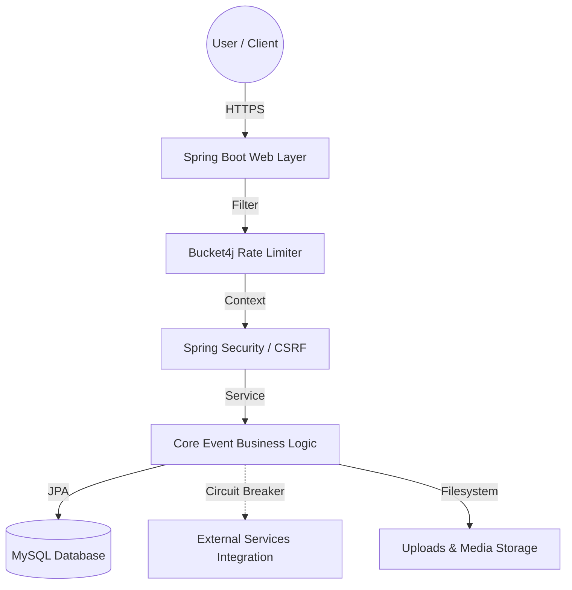

# 🎓 CampusConnect (Campus Event Manager)

<p align="center">
  
</p>

> *A premium, full-stack event management ecosystem engineered for high-performance university communities.*

<p align="center">
  <a href="https://www.oracle.com/java/technologies/downloads/"></a>
  <a href="https://spring.io/projects/spring-boot"></a>
  <a href="#-security-hardening-zero-trust"></a>
  <a href="https://flywaydb.org/"></a>
  <a href="#-architecture-resilience"></a>
</p>

---

## 📖 Table of Contents
- [Project Overview](#-project-overview)
- [Key Features](#-key-features)
- [Technical Architecture](#️-technical-architecture)
- [Security & Reliability](#-security--reliability)
- [Getting Started](#-getting-started)
- [Environment Variables](#️-environment-variables)
- [Default Accounts](#-default-accounts)

---

## 🎯 Project Overview

**CampusConnect** is a sophisticated university middleware designed with a **mobile-first** philosophy. Developed to bridge the communication gap between student organizations and university administrations, the platform leverages modern UI/UX design principles—like glassmorphism and micro-animations—coupled with enterprise-grade backend stability to provide a cohesive, scalable, and secure campus experience.

### 📱 Preview
<p align="center">
  
</p>

---

## ✨ Key Features

### 🧑‍🎓 For Students
- **Mobile-First & Glassmorphism UI**: A highly responsive, premium, translucent interface inspired by modern design trends.
- **Micro-Animations**: Fluid transitions and interactive elements for an engaging end-user experience.
- **Dynamic QR Integration**: Automatic registration QR codes for instant, contactless event enrollment.
- **Calendar Synchronization**: Export events directly to Google/Outlook with a single click.
- **Smart Filtering & Search**: Categorize events by distinct domains such as *Technical*, *Cultural*, *Sports*, and *Workshop*.

### 👨‍💼 For Administrators
- **Interactive Analytics**: Dashboard driven by `Chart.js` for real-time engagement and registration tracking.
- **Lifecycle Management**: Robust administrative controls for secure creation, modification, and automated lifecycle handling of events.
- **Data Export & Reporting**: One-click CSV export functionality for university-wide event statistics and audits.
- **System Health Monitoring**: Real-time server resource tracking directly from the admin panel.

---

## 🏗️ Technical Architecture

CampusConnect follows a clean, highly modular architecture with strictly defined boundaries for core logic, web security, and data persistence.



### 🛠️ Technology Stack
| Layer | Technology |
| :--- | :--- |
| **Backend** | Java 21, Spring Boot 3.4.2 |
| **Security** | Spring Security 6.x, Bucket4j, Session Management |
| **Resilience**| Resilience4j (Circuit Breaker) |
| **Frontend** | Thymeleaf, Vanilla CSS (Glassmorphism), JavaScript (ES6) |
| **Database** | MySQL 8.x (InnoDB), Flyway Migrations, Spring Data JPA / Hibernate |
| **Observability** | Logstash Encoder (MDC), SLF4J, Logback |

---

## 🛡️ Security & Reliability

### Security Hardening (Zero-Trust)
Our foundation is built upon a comprehensive Zero-Trust security model:
- **Authentication Resilience**: Atomic BCrypt hashing implementation (Strength 12) negating timing side-channel attacks.
- **Session & CSRF Protection**: Hardened CSRF tokens and strict `SameSite=Strict`, `HttpOnly`, `Secure` cookie policies.
- **Concurrency Control**: Pessimistic Write Locking (`PESSIMISTIC_WRITE`) applied on critical registration paths to completely prevent race conditions.
- **Upload Protection**: File uploads are secured via strict symbolic link validation, MIME checking, and UUID-based filename sanitization.
- **Rate Limiting**: Integrated Bucket4j interceptors to prevent brute-force attacks and DDOS attempts.

### Architecture Resilience
- **Fail-Safe Processing**: All external calls are wrapped in a **Resilience4j Circuit Breaker** preventing cascading unresponsiveness.
- **Database Migrations**: Flyway ensures deterministic, transactional database schema versioning and deployment consistency.

---

## 🚀 Getting Started

### Prerequisites
- **Java 21+** (JDK)
- **MySQL Server 8.x**
- **Maven 3.9+** (or use the provided wrapper)
- **PowerShell** (for Windows helper scripts)

### Installation & Setup

1. **Clone the Repository**
   ```bash
   git clone https://github.com/tejaswin-amara/campus-event-manager.git
   cd campus-event-manager
   ```

2. **Initialize Database**
   Ensure your MySQL server is running. Create a new database named `campus_events` (or let the application auto-create it depending on environment configuration for `spring.datasource.url`).

3. **Run the Application**
   For Windows environments, a streamlined script is provided:
   ```powershell
   .\run_app.ps1
   ```
   *Alternatively, run traditionally via Maven:*
   ```bash
   ./mvnw spring-boot:run
   ```

4. **Access the App**
   Open your browser and navigate to: `http://localhost:9090` (or your configured port).
   
### Graceful Shutdown
To cleanly stop the application and release resources via PowerShell:
```powershell
.\stop_app.ps1
```

---

## ⚙️ Environment Variables

The application can be fully configured without modifying `application.properties` by injecting the following environment variables:

| Variable | Description | Default Value |
| :--- | :--- | :--- |
| `PORT` | Application server port | `9090` |
| `MYSQLHOST` | Database host | `localhost` |
| `MYSQLPORT` | Database port | `3306` |
| `MYSQLDATABASE` | Database name | `campus_events` |
| `MYSQLUSER` | Database user | `root` |
| `MYSQLPASSWORD` | Database password | `root` |
| `ADMIN_PASSWORD` | Bootstrap password for admin | `admin123` |
| `LOG_LEVEL` | Application logging verbosity | `DEBUG` |
| `UPLOAD_DIR` | Directory relative to app for uploads | `uploads` |

---

## 🔑 Default Accounts

On initial start, the database is populated via Flyway scripts with default credentials.

| Role | Access | Username | Password |
| :--- | :--- | :--- | :--- |
| **Administrator** | `/admin/dashboard` | `admin` | *(Set via `ADMIN_PASSWORD` env var, defaults to `admin123`)* |
| **Student (General User)** | `/` | *Guest / Managed* | *Automatic / No password required* |

> **Note:** The student authentication is integrated according to specific university guidelines to be strictly seamless.

---

<p align="center">
  <br>
  Created and maintained by <strong>Tejaswin Amara</strong> <br>
  <i>Integrated as per university guidelines. All rights reserved.</i>
</p>
