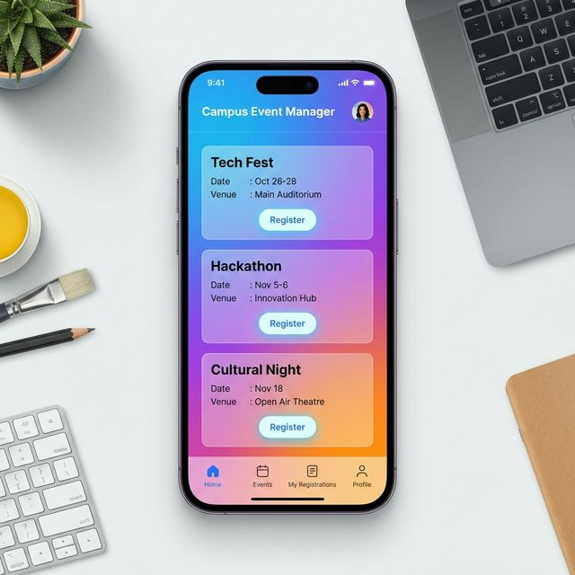
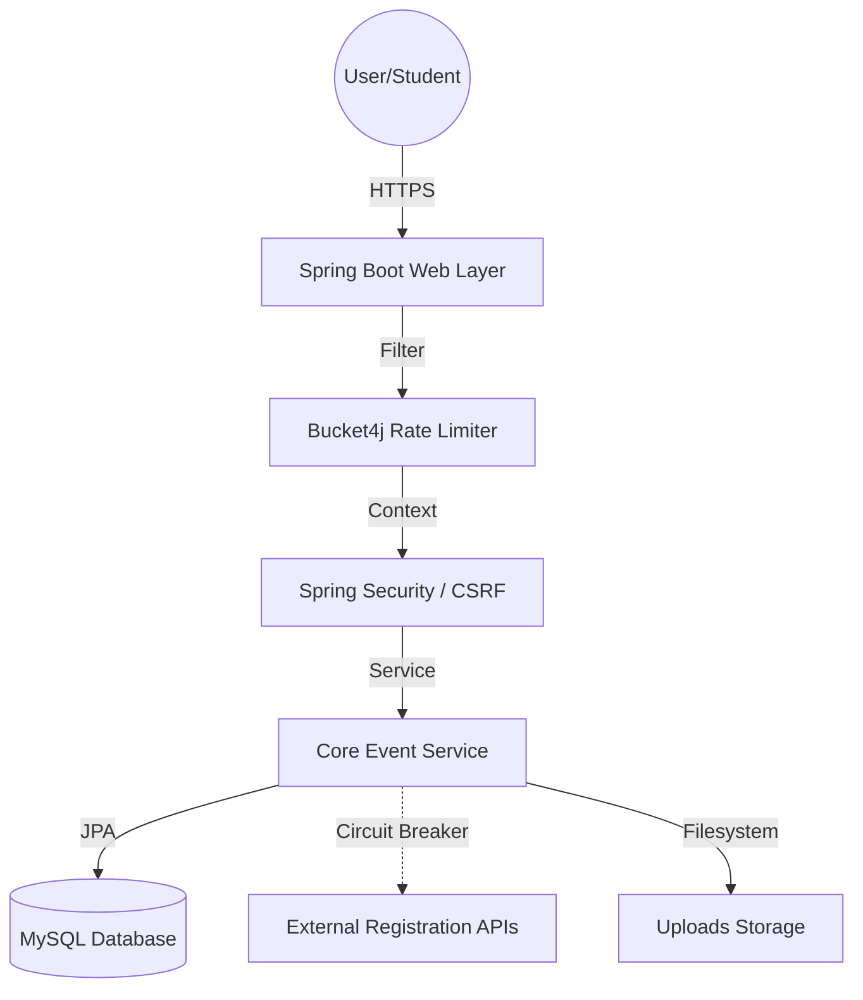

# 🎓 Campus Event Manager (CampusConnect)
  


*A premium, full-stack event management ecosystem for high-performance university communities.*

[](https://www.oracle.com/java/technologies/downloads/)
[](https://spring.io/projects/spring-boot)
[](#-security-hardening)
[](https://flywaydb.org/)
[](#-architecture-resilience)

[Getting Started](#-getting-started) · [Architecture](#-technical-architecture) · [Security](#-security-hardening-zero-trust)

---
## 🎯 Project Overview

**CampusConnect** is more than just an event listing site; it's a sophisticated university middleware designed with a **mobile-first** philosophy. Developed to bridge the communication gap between student organizations and university administrations, the platform leverages cutting-edge web design (glassmorphism, micro-animations) and enterprise-grade backend stability to provide a "handheld-first" campus experience.

### 📱 Preview


---

## ✨ Features

### 🧑‍🎓 For Students
- **Glassmorphism UI**: A premium, translucent interface inspired by modern design trends.
- **Micro-Animations**: Fluid transitions and interactive elements for enhanced engagement.
- **Dynamic QR Integration**: Automatic registration QR codes for instant event enrollment.
- **Calendar Synchronization**: Export events directly to Google/Outlook with one click.
- **Smart Filtering**: Categorize events by *Technical*, *Cultural*, *Sports*, *Workshop*, and more.

### 👨‍💼 For Administrators
- **Interactive Analytics**: Real-time data visualization via `Chart.js` for engagement tracking.
- **Lifecycle Management**: Secure creation, modification, and automated cleanup of event assets.
- **Data Export**: One-click CSV export of university-wide event statistics.
- **Health Monitoring**: Real-time server resource tracking (CPU, Memory) directly in the panel.

---

## 🏗️ Technical Architecture

The application follows a clean, hexagonal-lite architecture with clearly defined boundaries for logic, security, and persistence.



### 🛡️ Security Hardening (Zero-Trust)
Our 2026 security audit implemented a comprehensive Zero-Trust model:
- **Authentication**: Atomic BCrypt hashing with constant-time comparison to negate side-channel attacks.
- **Session Protection**: Hardened CSRF tokens and strict `SameSite=Strict`, `HttpOnly`, `Secure` cookie policies.
- **Concurrency Control**: Pessimistic Write Locking (`PESSIMISTIC_WRITE`) on critical registration paths to prevent race conditions.
- **Resource Protection**: Symbolic link validation and UUID-based filename sanitization for all uploads.

### ⚡ Architecture Resilience
- **Resilience4j Implementation**: All external registration redirects are wrapped in a **Circuit Breaker**.
- **Flyway Migrations**: Transactional database schema management ensuring consistency across environments.
- **Observability**: Structured MDC-based logging with Logstash encoder for auditability.

---

## 🛠️ Technology Stack

| Layer | Technology |
| :--- | :--- |
| **Backend** | Java 21, Spring Boot 3.4.2 |
| **Security** | Spring Security 6.x, Bucket4j, Resilience4j |
| **Frontend** | Thymeleaf, Vanilla CSS (Glassmorphism), JavaScript (ES6) |
| **Database** | MySQL (InnoDB), Flyway (Migrations), JPA/Hibernate |
| **Observability** | Logback (MDC), Logstash Encoder, SLF4J |
| **Tools** | Maven, Docker, Chart.js, QRGen |

---

## 🚀 Getting Started

### Prerequisites
- JDK 21+
- MySQL Server 8.x
- Docker (Optional)

### Installation
1. **Clone & Setup Environment:**
   ```bash
   git clone https://github.com/tejaswin-amara/campus-event-manager.git
   cd campus-event-manager
   ```

2. **Configure Database:**
   Update your `application.properties` or set environment variables:
   - `SPRING_DATASOURCE_URL`
   - `SPRING_DATASOURCE_USERNAME`
   - `SPRING_DATASOURCE_PASSWORD`

3. **Run via PowerShell (Recommended):**
---

## 🔑 Default Accounts
| Role | Username | Password |
| :--- | :--- | :--- |
| **Admin** | `admin` | *(set via `ADMIN_PASSWORD` env var on first run)* |
| **Student** | *Guest Access* | *Automatic* |

> Integrated as per university guidelines. All rights reserved.
Created with ❤️ by **Tejaswin Amara**
