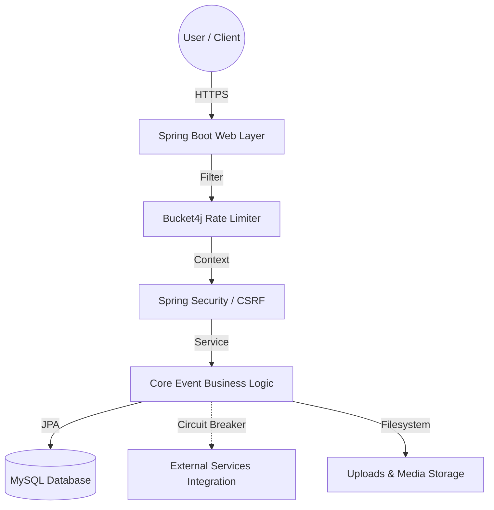

# 🎓 CampusConnect

<p align="center">
  
</p>

> *A premium, full-stack event management ecosystem engineered for high-performance university communities.*

<p align="center">
  <a href="https://www.oracle.com/java/technologies/downloads/"></a>
  <a href="https://spring.io/projects/spring-boot"></a>
  <a href="#%EF%B8%8F-security--reliability"></a>
  <a href="https://flywaydb.org/"></a>
  <a href="#architecture-resilience"></a>
  <a href="LICENSE"></a>
</p>

---

## 📖 Table of Contents

- [Project Overview](#-project-overview)
- [Key Features](#-key-features)
- [Technical Architecture](#%EF%B8%8F-technical-architecture)
- [Security & Reliability](#%EF%B8%8F-security--reliability)
- [Getting Started](#-getting-started)
- [Docker Deployment](#-docker-deployment)
- [Environment Variables](#%EF%B8%8F-environment-variables)
- [Default Accounts](#-default-accounts)
- [API Documentation](#-api-documentation)
- [Contributing](#-contributing)
- [License](#-license)

---

## 🎯 Project Overview

**CampusConnect** is a sophisticated university middleware designed with a **mobile-first** philosophy. It bridges the communication gap between student organizations and university administrations, leveraging modern UI/UX design principles—like glassmorphism and micro-animations—coupled with enterprise-grade backend stability to provide a cohesive, scalable, and secure campus experience.

### 📱 Preview

<p align="center">
  
</p>

---

## ✨ Key Features

### 🧑‍🎓 For Students

- **Mobile-First & Glassmorphism UI** — Highly responsive, premium, translucent interface.
- **Micro-Animations** — Fluid transitions and interactive elements for an engaging experience.
- **Dynamic QR Integration** — Automatic registration QR codes for instant, contactless event enrollment.
- **Calendar Sync** — Export events directly to Google / Outlook with a single click.
- **Smart Filtering** — Categorize events by *Technical*, *Cultural*, *Sports*, and *Workshop*.

### 👨‍💼 For Administrators

- **Interactive Analytics** — Dashboard powered by Chart.js with real-time engagement tracking.
- **Lifecycle Management** — Robust administrative controls for event creation, modification, and automated lifecycle handling.
- **Data Export** — One-click CSV export for university-wide event statistics and audits.
- **System Health Monitoring** — Real-time server resource tracking from the admin panel.

---

## 🏗️ Technical Architecture

CampusConnect follows a clean, highly modular architecture with strictly defined boundaries for core logic, web security, and data persistence.



### 🛠️ Technology Stack

| Layer | Technology |
| :--- | :--- |
| **Backend** | Java 21, Spring Boot 3.4.13 |
| **Security** | Spring Security 6.x, Bucket4j, Session Management |
| **Resilience** | Resilience4j (Circuit Breaker) |
| **Frontend** | Thymeleaf, Vanilla CSS (Glassmorphism), JavaScript (ES6) |
| **Database** | MySQL 8.x (InnoDB), Flyway Migrations, Spring Data JPA / Hibernate |
| **Observability** | Logstash Encoder (MDC), SLF4J, Logback |
| **Build** | Maven (Wrapper), JaCoCo Code Coverage |

---

## 🛡️ Security & Reliability

### Security Hardening (Zero-Trust)

- **BCrypt Authentication** — Atomic BCrypt hashing (Strength 12) with constant-time dummy execution to negate timing side-channel attacks.
- **Session & CSRF Protection** — Hardened CSRF tokens with `SameSite=Strict`, `HttpOnly`, `Secure` cookie policies.
- **Concurrency Control** — Pessimistic Write Locking (`PESSIMISTIC_WRITE`) on critical registration paths to prevent race conditions.
- **Upload Protection** — Strict symbolic link validation, MIME checking, and UUID-based filename sanitization.
- **Rate Limiting** — Bucket4j interceptors throttling login attempts to 5 requests per 15 minutes per IP.

### Architecture Resilience

- **Fail-Safe Processing** — External calls are wrapped in a Resilience4j Circuit Breaker to prevent cascading failures.
- **Database Migrations** — Flyway ensures deterministic, transactional schema versioning.

---

## 🚀 Getting Started

### Prerequisites

- **Java 21+** (JDK)
- **MySQL Server 8.x**
- **Maven 3.9+** (or use the included wrapper)

### Quick Start

1. **Clone the Repository**

   ```bash
   git clone https://github.com/tejaswin-amara/campus-connect.git
   cd campus-connect
   ```

2. **Initialize Database**

   Ensure MySQL is running. The application will auto-create the `campus_events` database if it doesn't exist.

3. **Run the Application**

   ```bash
   # Using Maven Wrapper (recommended)
   ./mvnw spring-boot:run

   # Windows PowerShell
   .\run_app.ps1
   ```

4. **Open the App**

   Navigate to [`http://localhost:9090`](http://localhost:9090).

### Stopping the Application

```powershell
.\stop_app.ps1
```

---

## 🐳 Docker Deployment

### Using Docker Compose (Recommended)

Spin up the full stack (MySQL + App) with a single command:

```bash
docker compose up -d
```

The app will be accessible at [`http://localhost:9090`](http://localhost:9090).

### Manual Docker Build

```bash
docker build -t campus-connect .
docker run -p 9090:9090 \
  -e SPRING_DATASOURCE_URL=jdbc:mysql://host.docker.internal:3306/campus_events \
  -e MYSQLUSER=root \
  -e MYSQLPASSWORD=root \
  campus-connect
```

### Railway Deployment

1. Push your code to GitHub.
2. Go to the [Railway Dashboard](https://railway.app/dashboard) → **New Project** → **Deploy from GitHub repo**.
3. Select the `campus-connect` repository.
4. Railway will auto-detect the `Dockerfile` and deploy.

---

## ⚙️ Environment Variables

| Variable | Description | Default |
| :--- | :--- | :--- |
| `PORT` | Application server port | `9090` |
| `MYSQLHOST` | Database host | `localhost` |
| `MYSQLPORT` | Database port | `3306` |
| `MYSQLDATABASE` | Database name | `campus_events` |
| `MYSQLUSER` | Database user | `root` |
| `MYSQLPASSWORD` | Database password | `root` |
| `ADMIN_PASSWORD` | Bootstrap admin password | `admin123` |
| `LOG_LEVEL` | Application logging verbosity | `DEBUG` *(use `INFO` or `WARN` in production)* |
| `UPLOAD_DIR` | Upload directory path | `uploads` |

---

## 🔑 Default Accounts

On first start, the database is populated via Flyway migrations with the following defaults:

| Role | Portal | Username | Password |
| :--- | :--- | :--- | :--- |
| **Administrator** | `/admin/dashboard` | `admin` | *Set via `ADMIN_PASSWORD` env var* |
| **Student** | `/` | — | *No login required (seamless access)* |

> **⚠️ Important:** Change the default admin password in production by setting the `ADMIN_PASSWORD` environment variable.

---

## 📚 API Documentation

Interactive API documentation is available via **Swagger UI** when the application is running:

- **Swagger UI:** [`http://localhost:9090/swagger-ui.html`](http://localhost:9090/swagger-ui.html)
- **OpenAPI JSON:** [`http://localhost:9090/v3/api-docs`](http://localhost:9090/v3/api-docs)

---

## 🤝 Contributing

Contributions are welcome! Please read the [Contributing Guide](CONTRIBUTING.md) and the [Technical Guide](TECHNICAL_GUIDE.md) before submitting a pull request.

---

## 📄 License

This project is licensed under the **MIT License** — see the [LICENSE](LICENSE) file for details.

---

<p align="center">
  <br>
  Created and maintained by <strong>Tejaswin Amara</strong> <br>
  <i>Integrated as per university guidelines.</i>
</p>
