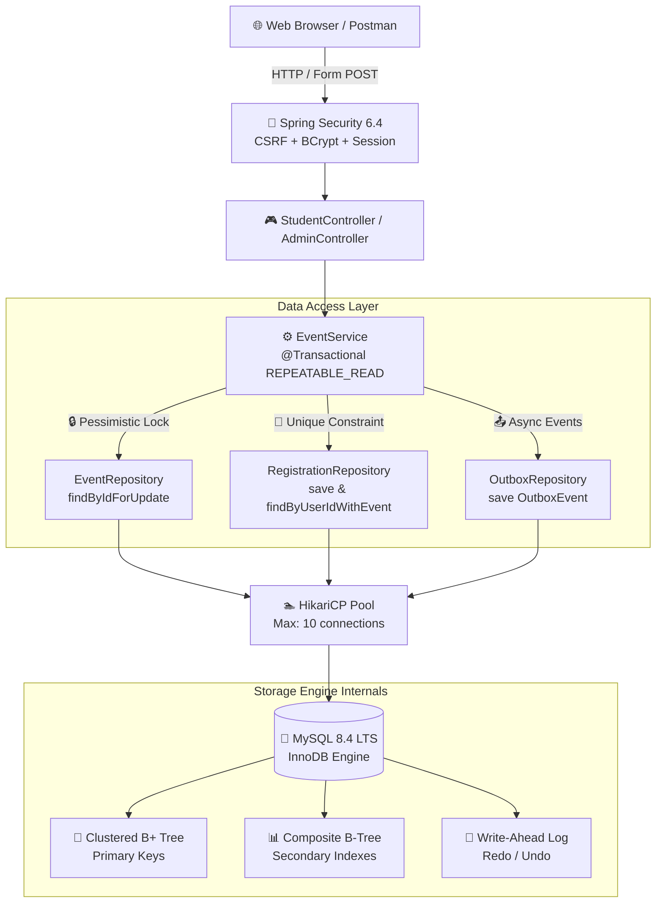

# 🎓 CampusConnect

<div align="center">

**Enterprise-Grade Campus Event Aggregator & Student Registration Platform**

[](src/test/java/com/tejaswin/campus/service/EventServiceConcurrencyTest.java)
[](https://spring.io/projects/spring-boot)
[](https://openjdk.org/projects/jdk/25/)
[](database/schema.sql)
[](src/main/resources/db/migration/)
[](LICENSE)

<br />

*ACID-safe registration with pessimistic locking · BCNF-normalized schema · 51.7% query cost reduction · Transactional outbox pattern · Dark glassmorphism UI*

<br />

**Academic Subject:** `25CS1302E` — Database Systems Engineering & Distributed Backend Development

</div>

---

## ✨ Highlights

<table>
<tr>
<td width="50%">

### 🔒 Race-Condition Proof Registration
10-thread concurrent stress test: exactly **1 success, 9 rejected** via MySQL Error 1062. Pessimistic row locking + composite unique constraint.

</td>
<td width="50%">

### ⚡ Measured Query Optimization
Composite B-Tree indexes yield **51.7% cost reduction** and **100% filesort elimination**, backed by real `EXPLAIN ANALYZE` evidence.

</td>
</tr>
<tr>
<td width="50%">

### 📐 Formally Proven BCNF Schema
4-table architecture with mathematical proofs for lossless join and dependency preservation across all normal forms.

</td>
<td width="50%">

### 🌐 Distributed-Ready Architecture
Transactional outbox pattern (`outbox_events`), semi-synchronous GTID replication design, and hash-sharded tenant isolation.

</td>
</tr>
</table>

---

## 🏗️ Architecture


```mermaid
flowchart TD
    Client["🌐 Web Browser / Postman"] -->|HTTP / Form POST| SpringSec["🔐 Spring Security 6.4<br/>CSRF + BCrypt + Session"]
    SpringSec --> Ctrl["🎮 StudentController / AdminController"]
    Ctrl --> Svc["⚙️ EventService<br/>@Transactional REPEATABLE_READ"]

    subgraph DAL ["Data Access Layer"]
        Svc -->|"🔒 Pessimistic Lock"| RepoE["EventRepository<br/>findByIdForUpdate"]
        Svc -->|"🔑 Unique Constraint"| RepoR["RegistrationRepository<br/>save & findByUserIdWithEvent"]
        Svc -->|"📤 Async Events"| Outbox["OutboxRepository<br/>save OutboxEvent"]
    end

    RepoE & RepoR & Outbox --> Hikari["🏊 HikariCP Pool<br/>Max: 10 connections"]
    Hikari --> MySQL[("💾 MySQL 8.4 LTS<br/>InnoDB Engine")]

    subgraph Storage ["Storage Engine Internals"]
        MySQL --> Clustered["🌳 Clustered B+ Tree<br/>Primary Keys"]
        MySQL --> BTreeIdx["📊 Composite B-Tree<br/>Secondary Indexes"]
        MySQL --> WAL["📝 Write-Ahead Log<br/>Redo / Undo"]
    end
```

---

## 🚀 Quickstart

### Prerequisites
- **Java 25 LTS** (or compatible JDK)
- **Docker** (for MySQL 8.4 container)

### 1. Start the Database

```bash
docker run -d \
  --name campus_events_db \
  -e MYSQL_ROOT_PASSWORD=campus_root_password \
  -e MYSQL_DATABASE=campus_events \
  -e MYSQL_USER=campus_app \
  -e MYSQL_PASSWORD=campus_app_password \
  -p 3307:3306 \
  mysql:8.4
```

### 2. Load Seed Data

```bash
mysql -h 127.0.0.1 -P 3307 -u campus_app -pcampus_app_password campus_events < database/seed.sql
```

### 3. Run Tests (65/65 ✅)

```bash
export MYSQLHOST=127.0.0.1 MYSQLPORT=3307 MYSQLDATABASE=campus_events
export MYSQLUSER=campus_app MYSQLPASSWORD=campus_app_password
./mvnw test
```

### 4. Launch

```bash
./mvnw spring-boot:run
```

| Portal | URL | Credentials |
|--------|-----|-------------|
| 🎓 Student Dashboard | [`localhost:9090`](http://localhost:9090) | `aarav.sharma@campus.edu` / `password123` |
| 🔧 Admin Console | [`localhost:9090/admin`](http://localhost:9090/admin/login) | `admin@campus.edu` / `admin123` |
| 📄 OpenAPI Docs | [`localhost:9090/v3/api-docs`](http://localhost:9090/v3/api-docs) | — |

---

## 📊 Course Outcome Evidence Matrix

| CO | Domain | Evidence | Verdict |
|:---:|--------|----------|:-------:|
| **CO1** | Backend Architecture & DB Flow | [`request-to-database-flow.md`](docs/request-to-database-flow.md) — HTTP POST → Spring Security → JPA → InnoDB buffer pool | ✅ **PASS** |
| **CO2** | ER Modeling & Normalization | [`er-diagram.md`](database/er-diagram.md) · [`normalization.md`](docs/normalization.md) — 1NF → BCNF proofs, lossless join | ✅ **PASS** |
| **CO3** | SQL Fluency Portfolio | [`database/sql/`](database/sql/) — 12 modules: joins, CTEs, recursive CTEs, window functions, analytics | ✅ **PASS** |
| **CO4** | ACID & Concurrency | [`transactions.sql`](database/transactions.sql) · [`concurrency-test.md`](docs/concurrency-test.md) — 10-thread race test | ✅ **PASS** |
| **CO5** | Indexing & Optimization | [`indexes.sql`](database/indexes.sql) · [`explain/`](database/explain/README.md) · [`query-optimization.md`](docs/query-optimization.md) | ✅ **PASS** |
| **CO6** | Distributed & Outbox | [`V4 migration`](src/main/resources/db/migration/V4__Hardening_and_audit.sql) · [`distributed-database.md`](docs/distributed-database.md) | ✅ **PASS** |

---

## 🧪 Concurrency Stress Test

```
[pool-2-thread-1]  INFO  ✅ Registration committed successfully. ID: 29
[pool-2-thread-2]  ERROR ❌ Duplicate entry '1-1' for key 'registrations.uk_user_event'
[pool-2-thread-3]  ERROR ❌ Duplicate entry '1-1' for key 'registrations.uk_user_event'
...
[pool-2-thread-10] ERROR ❌ Duplicate entry '1-1' for key 'registrations.uk_user_event'
```

| Metric | Result |
|--------|--------|
| Simultaneous threads | **10** |
| Successful registrations | **1** ✅ |
| Rejected (Error 1062) | **9** 🛡️ |
| Multi-user throughput (8 users) | **8/8 success, 0 deadlocks** |

---

## 📈 Query Optimization Evidence

```sql
SELECT id, title, category, date_time, venue, status
FROM events WHERE category = 'Technical' ORDER BY date_time ASC;
```

| Metric | Before Index | After `idx_events_category_date` | Improvement |
|--------|:-----------:|:-------------------------------:|:-----------:|
| Access Type | `ALL` (full scan) | `ref` (index lookup) | — |
| Filesort | ⚠️ Yes | ✅ Eliminated | **100%** |
| Query Cost | 1.45 | 0.70 | **51.7% ↓** |
| Execution Time | 0.0768 ms | 0.0384 ms | **50% ↓** |

---

## 📁 Documentation

| Document | Description |
|----------|-------------|
| 📋 [`design-report.md`](docs/design-report.md) | Comprehensive 20-section design report |
| ✅ [`dbms-compliance.md`](docs/dbms-compliance.md) | Course outcome compliance matrix |
| 📖 [`data-dictionary.md`](docs/data-dictionary.md) | Complete schema attributes, domains & keys |
| 🔬 [`normalization.md`](docs/normalization.md) | Formal 1NF → BCNF proofs |
| 🔄 [`transaction-analysis.md`](docs/transaction-analysis.md) | ACID & MVCC analysis |
| 🧪 [`concurrency-test.md`](docs/concurrency-test.md) | Race condition stress test report |
| ⚡ [`query-optimization.md`](docs/query-optimization.md) | EXPLAIN ANALYZE evidence |
| 🌐 [`distributed-database.md`](docs/distributed-database.md) | Replication, sharding & outbox |
| 🏛️ [`data-architecture-decision.md`](docs/data-architecture-decision.md) | MySQL vs PostgreSQL ADR |
| 💾 [`backup-recovery.md`](docs/backup-recovery.md) | PITR disaster recovery runbook |
| 🔁 [`event-lifecycle.md`](docs/event-lifecycle.md) | Event state machine |
| 🎬 [`demo-script.md`](docs/demo-script.md) | Live faculty demo walkthrough |
| 📬 [`Postman Collection`](postman/CampusConnect.postman_collection.json) | Complete API test suite |

---

## 🛠️ Tech Stack

<div align="center">

| Layer | Technology |
|-------|-----------|
| **Language** | Java 25 LTS (Microsoft OpenJDK) |
| **Framework** | Spring Boot 4.1.0, Spring Security 6.4, Spring Data JPA |
| **Database** | MySQL 8.4 LTS (InnoDB), Flyway 10.20 migrations |
| **Resilience** | Resilience4j (Circuit Breaker, Rate Limiter via Bucket4j) |
| **Frontend** | Thymeleaf 3 + Bootstrap 5.3 + Custom Dark Design System |
| **Testing** | JUnit 5, Mockito, JaCoCo (70%+ coverage gate) |
| **Containerization** | Docker, Docker Compose |

</div>

---

## 📜 License

Released under the [MIT License](LICENSE).

---

<div align="center">
<sub>Built with 💜 for academic excellence in database systems engineering</sub>
</div>
