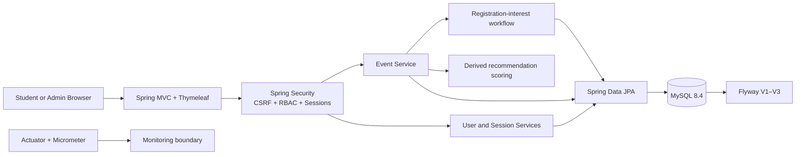

# CampusConnect

> **A trustworthy campus event catalogue with a secure administrative control plane.**

CampusConnect helps universities publish events, give students a fast way to discover what is happening, and provide administrators with controlled lifecycle management and engagement visibility. The current website is a **Spring Boot modular monolith**: one deployable application with explicit event, identity, registration-interest, recommendation, and operations boundaries.

[](https://github.com/tejaswin-amara/campus-connect/actions/workflows/ci.yml)
[](https://openjdk.org/projects/jdk/25/)
[](https://spring.io/projects/spring-boot)
[](LICENSE)

> **Production posture.** The repository is production-oriented and suitable for a controlled deployment after environment-specific secrets, TLS, persistent storage, backups, monitoring ownership, and a release approval process are configured. Technologies such as MongoDB, pgvector, Kafka, FastAPI, Node.js, and Kubernetes are documented as bounded evolution paths; they are not falsely claimed as deployed runtime components.

## Product at a glance

| Capability | Current behavior |
| --- | --- |
| Event discovery | Public, server-rendered catalogue with search, category filtering, pagination, event details, and upcoming-event recommendations |
| Administration | `ADMIN`-protected event create, update, delete, filtering, analytics, and CSV export workflows |
| Interest tracking | At most one user-event interest row, enforced by a unique constraint and transaction-safe locking; the configured external registration link remains authoritative |
| Media | Validated event image uploads stored as database-backed media with bounded size and type checks |
| Security | BCrypt, CSRF, session-fixation mitigation, RBAC, login rate limiting, secure headers, safe redirects, and audit logging |
| Operations | Flyway migrations, Hibernate validation, Actuator health, Prometheus metrics, structured logs, Docker Compose, and GitHub Actions |

## Stable technology baseline

| Layer | Version or approach |
| --- | --- |
| Runtime | Java 25; Eclipse Temurin 25 JDK/JRE container images |
| Backend | Spring Boot 4.1.0, Spring Framework 7, Spring MVC, Thymeleaf, Spring Security, Spring Data JPA |
| Database | MySQL 8.4 LTS with Flyway V1–V3 migrations |
| Build | Maven Wrapper using Maven 3.9.11 |
| Quality | JaCoCo 0.8.15, Surefire 3.5.4, 63 automated tests, line and branch gates |
| Resilience and observability | Resilience4j 2.4.0 Boot 4 adapter, Bucket4j 8.10.1, Actuator, Micrometer Prometheus registry |

See [`docs/stable-versions.md`](docs/stable-versions.md) for the complete compatibility record and intentional pins.

## Quick start with Docker Compose

The most reproducible local path starts the application and MySQL together.

```bash
cp .env.example .env
# Replace every placeholder in .env with local-only values.
docker compose up --build -d
BASE_URL=http://localhost:9090 ./scripts/smoke-test.sh
```

The website is available at `http://localhost:9090`. Operational endpoints are:

| Endpoint | Purpose |
| --- | --- |
| `/actuator/health` | Liveness/readiness-oriented health response |
| `/v3/api-docs` | Generated OpenAPI document |
| `/swagger-ui.html` | Interactive API documentation when enabled |
| `/actuator/prometheus` | Prometheus scrape endpoint; protect it at the network or ingress layer |

To stop the stack:

```bash
docker compose down
```

## Local Maven workflow

For a local MySQL installation, export the required variables before invoking the Maven Wrapper. Production uses Flyway as the schema authority and Hibernate `validate`; do not use `DDL_AUTO=update` in production.

```bash
export MYSQLHOST=localhost
export MYSQLPORT=3306
export MYSQLDATABASE=campus_events
export MYSQLUSER=campus_app
export MYSQLPASSWORD='replace-with-a-local-password'
export ADMIN_PASSWORD='replace-with-a-unique-admin-secret'
export DDL_AUTO=validate

./mvnw -B verify
./mvnw spring-boot:run
```

The committed CI and Compose configurations use MySQL 8.4. A local MySQL 8.0 installation may not be accepted by Flyway 12; follow [`docs/operations/README.md`](docs/operations/README.md) for the safe local verification alternative.

## Configuration contract

Credentials are intentionally absent from source control. Compose fails fast when required secrets are missing, and production bootstrap refuses to use a known admin password.

| Variable | Required | Purpose | Production guidance |
| --- | :---: | --- | --- |
| `MYSQLHOST`, `MYSQLPORT` | Yes | Database network location | Use a private managed endpoint |
| `MYSQLDATABASE` | Yes | Database name | Provision before application startup |
| `MYSQLUSER`, `MYSQLPASSWORD` | Yes | Least-privilege application account | Never use the database root account |
| `MYSQL_ROOT_PASSWORD` | Compose only | Local database initialization | Keep in a secret manager or local `.env` only |
| `ADMIN_PASSWORD` | Yes | Admin bootstrap/synchronization secret | Supply through a secret manager; never bake into an image |
| `SPRING_PROFILES_ACTIVE` | Recommended | Profile selection | Use `prod` for strict production overrides |
| `DDL_AUTO` | Recommended | Hibernate schema behavior | Keep `validate` with Flyway-controlled migrations |
| `COOKIE_SECURE` | Recommended | HTTPS-only session cookies | Set `true` behind HTTPS |
| `MYSQL_USE_SSL` | Recommended | MySQL TLS connection | Enable with certificate verification in production |
| `UPLOAD_DIR` | Recommended | Persistent media path | Mount durable storage and back it up |
| `LOG_LEVEL` | Optional | Application logging level | Prefer `INFO` or `WARN` |

## Architecture at a glance


```mermaid
flowchart LR
    Browser[Student or Admin Browser] --> Web[Spring MVC + Thymeleaf]
    Web --> Security[Spring Security\nCSRF + RBAC + Sessions]
    Security --> Event[Event Service]
    Security --> Identity[User and Session Services]
    Event --> Interest[Registration-interest workflow]
    Event --> Recommendation[Derived recommendation scoring]
    Event --> JPA[Spring Data JPA]
    Identity --> JPA
    Interest --> JPA
    JPA --> MySQL[(MySQL 8.4)]
    MySQL --> Flyway[Flyway V1–V3]
    AppOps[Actuator + Micrometer] --> Ops[Monitoring boundary]
```

The system intentionally remains a modular monolith. The logical boundaries are explicit enough to support future extraction, while the current deployment keeps transactions, security, and operations simple. See the [C4 architecture package](docs/architecture/README.md).

## Handout compliance

The DBSE&DBD evidence package maps the implementation to CO1–CO6 without overstating what is live.

| Outcome | Evidence summary |
| --- | --- |
| CO1 | MySQL/JPA/Flyway normalization, constraints, indexes, transaction boundaries, pessimistic locking, and migration evidence |
| CO2 | SQL/NoSQL/vector trade-off analysis plus a tested relational recommendation scorer; no false claim of live Firestore, MongoDB, or pgvector |
| CO3 | Spring MVC routes, validation, Spring Security, OpenAPI, session authentication, error handling, and tests |
| CO4 | Spring Boot modular service layer with documented FastAPI and Node.js/Express extraction options |
| CO5 | Bounded contexts, resilience, REST/event-flow design, outbox/Saga guidance, and explicit modular-monolith limitation |
| CO6 | Dockerfile, Compose, MySQL 8.4 CI service, health/metrics, JaCoCo, dependency review, smoke/load checks, C4 diagrams, and showcase script |

Open the full [`docs/compliance-matrix.md`](docs/compliance-matrix.md) for file-level traceability.

## Documentation map

| Audience | Start here |
| --- | --- |
| New developer | [`docs/README.md`](docs/README.md), [`CONTRIBUTING.md`](CONTRIBUTING.md), [`PROJECT_STRUCTURE.md`](PROJECT_STRUCTURE.md) |
| Maintainer | [`TECHNICAL_GUIDE.md`](TECHNICAL_GUIDE.md), [`docs/architecture/README.md`](docs/architecture/README.md), [`docs/data/README.md`](docs/data/README.md) |
| Release operator | [`docs/operations/README.md`](docs/operations/README.md), [`docs/testing/README.md`](docs/testing/README.md), [`docs/stable-versions.md`](docs/stable-versions.md) |
| Security reviewer | [`docs/security/README.md`](docs/security/README.md), [`SECURITY.md`](SECURITY.md), [`docs/api/README.md`](docs/api/README.md) |
| DBSE&DBD evaluator | [`docs/compliance-matrix.md`](docs/compliance-matrix.md), [`docs/showcase.md`](docs/showcase.md), [`docs/reference-repositories.md`](docs/reference-repositories.md) |

## Verification commands

```bash
# Complete build, tests, package, migrations, and coverage gates
./mvnw -B verify

# Runtime health and OpenAPI checks
BASE_URL=http://localhost:9090 ./scripts/smoke-test.sh

# Repeatable lightweight concurrency sanity check
REQUESTS=100 CONCURRENCY=10 BASE_URL=http://localhost:9090 ./scripts/load-test.sh
```

## License and security

CampusConnect is released under the [MIT License](LICENSE). See [`SECURITY.md`](SECURITY.md) for responsible vulnerability reporting. Never commit `.env`, passwords, private keys, production database URLs, generated uploads, or temporary credentials.

## References

[1]: https://spring.io/projects/spring-boot "Spring Boot project"
[2]: https://docs.spring.io/spring-boot/docs/current/reference/html/actuator.html "Spring Boot Actuator reference"
[3]: https://documentation.red-gate.com/flyway/reference "Flyway reference"
[4]: https://docs.docker.com/compose/ "Docker Compose documentation"
[5]: https://docs.github.com/en/actions "GitHub Actions documentation"
[6]: https://micrometer.io/docs/registry/prometheus "Micrometer Prometheus registry"
[7]: https://owasp.org/API-Security/editions/2023/en/0x00-header/ "OWASP API Security Top 10"
