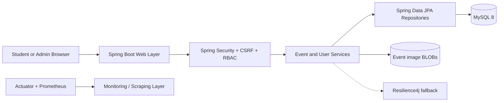

# CampusConnect

CampusConnect is a university event-management platform for publishing campus events, discovering upcoming activities, tracking student interest, and giving administrators a secure operational dashboard. The repository is implemented as a **Spring Boot modular monolith** with Thymeleaf, MySQL, Flyway, Spring Security, Resilience4j, Actuator, Prometheus metrics, and JaCoCo coverage.

> **Production posture:** the application is suitable for a production-oriented demonstration and a controlled deployment after environment-specific secrets, TLS, persistent storage, backups, and operational ownership are configured. This repository does not claim that MongoDB, pgvector, Kafka, or independently deployable Node.js/FastAPI services are already implemented; those are documented as bounded evolution paths where the course handout calls for them.

## What the product does

CampusConnect provides a public student experience for event discovery and event details, including category/search filtering and an external registration redirect. Administrators can create, update, delete, filter, analyze, and export events. Event images are validated and stored as database-backed media. The current registration record represents **student interest in an event**, while the authoritative registration transaction remains with the external link configured by an administrator.

| Capability | Current implementation |
| --- | --- |
| Event catalogue | Spring MVC and Thymeleaf with paginated discovery, search, category filtering, and event details |
| Administration | Role-protected dashboard for event lifecycle management, analytics, and CSV export |
| Authentication | Spring Security session authentication, BCrypt password hashing, CSRF protection, session-fixation mitigation, and admin RBAC |
| Database | MySQL 8 with JPA/Hibernate and Flyway migrations V1–V3 |
| Integrity | Unique user-event interests, foreign keys, event date checks, status checks, query-aware indexes, and transaction boundaries |
| Resilience | Bucket4j login rate limiting and Resilience4j registration fallback |
| Observability | Actuator health/info, Prometheus registry, structured logging, and audit logging |
| Delivery | Maven Wrapper, Dockerfile, Docker Compose, GitHub Actions verification, JaCoCo gate, dependency review, and container build |

## Quick start

The fastest reproducible local path uses Docker Compose. Copy `.env.example` to `.env`, replace every placeholder, and then start the stack.

```bash
cp .env.example .env
docker compose up --build -d
./scripts/smoke-test.sh
```

The application is then available at `http://localhost:9090`. The health endpoint is `http://localhost:9090/actuator/health`, and the generated OpenAPI document is available at `http://localhost:9090/v3/api-docs`. Prometheus metrics are exposed at `/actuator/prometheus`; protect this endpoint at the network or ingress layer in a real deployment.

For a local MySQL installation, set `MYSQLHOST`, `MYSQLPORT`, `MYSQLDATABASE`, `MYSQLUSER`, `MYSQLPASSWORD`, and `ADMIN_PASSWORD` in the shell before running the Maven Wrapper. Production startup uses Flyway as the schema authority and sets Hibernate to `validate`; do not use `DDL_AUTO=update` in production.

```bash
export MYSQLHOST=localhost
export MYSQLPORT=3306
export MYSQLDATABASE=campus_events
export MYSQLUSER=campus_app
export MYSQLPASSWORD='replace-with-a-local-password'
export ADMIN_PASSWORD='replace-with-a-unique-admin-secret'
export DDL_AUTO=validate
./mvnw -B verify
./mvnw spring-boot:run
```

## Configuration contract

Production credentials are intentionally not shipped as usable defaults. Compose fails fast when `MYSQLPASSWORD`, `MYSQL_ROOT_PASSWORD`, or `ADMIN_PASSWORD` is absent. The `.env.example` file contains placeholders only.

| Variable | Required | Purpose | Safe production guidance |
| --- | :---: | --- | --- |
| `MYSQLHOST` / `MYSQLPORT` | Yes | Database network location | Use a private managed database endpoint |
| `MYSQLDATABASE` | Yes | Database name | Provision it before startup |
| `MYSQLUSER` / `MYSQLPASSWORD` | Yes | Application database account | Use a least-privilege non-root account |
| `MYSQL_ROOT_PASSWORD` | Compose only | Local database initialization | Keep it out of source control and rotate it |
| `ADMIN_PASSWORD` | Yes | Admin bootstrap/synchronization secret | Supply through a secret manager, never README or image layers |
| `SPRING_PROFILES_ACTIVE` | Recommended | Runtime profile selection | Use `prod` for TLS and strict production overrides |
| `DDL_AUTO` | Recommended | Hibernate schema behavior | Use `validate` with Flyway-controlled migrations |
| `COOKIE_SECURE` | Recommended | HTTPS-only session cookies | Set `true` behind HTTPS |
| `MYSQL_USE_SSL` | Recommended | MySQL TLS flag | Set `true` with certificate verification in production |
| `UPLOAD_DIR` | Recommended | Persistent media path | Mount durable storage and back it up |
| `LOG_LEVEL` | Optional | Application log level | Prefer `INFO` or `WARN` in production |

## Architecture at a glance


```mermaid
flowchart LR
    Browser[Student or Admin Browser] --> Web[Spring Boot Web Layer]
    Web --> Security[Spring Security + CSRF + RBAC]
    Security --> Services[Event and User Services]
    Services --> Repositories[Spring Data JPA Repositories]
    Repositories --> MySQL[(MySQL 8)]
    Services --> Media[(Event image BLOBs)]
    Services -.-> Resilience[Resilience4j fallback]
    AppOps[Actuator + Prometheus] --> Ops[Monitoring / Scraping Layer]
```

The current architecture is intentionally a modular monolith. The documented bounded-context evolution path separates identity/access, event catalogue, registration/capacity, and activity/notification/search concerns without pretending that extraction has already happened. See [Architecture and C4 documentation](docs/architecture/README.md).

## Course-handout compliance

The attached DBSE&DBD handout expects concrete evidence across relational engineering, polyglot persistence, backend API design, architectural evolution, microservices concepts, deployment, observability, CI/CD, security, load testing, C4 diagrams, README quality, and final showcase. The compliance matrix maps each course outcome to source files, migrations, tests, scripts, and documentation.

| Outcome | Evidence status in this repository |
| --- | --- |
| CO1 | Implemented through MySQL/JPA/Flyway, normalized core entities, constraints, transaction boundaries, a pessimistic event-row lock, and V3 indexes/checks; documented in `docs/data/` |
| CO2 | SQL/NoSQL/vector trade-offs and a semantic-search evolution design are documented; the active implementation remains relational and does not falsely claim MongoDB or pgvector is live |
| CO3 | Implemented through Spring MVC/Spring Security validation and Springdoc OpenAPI; the API contract and security boundary are documented in `docs/api/` |
| CO4 | Spring Boot service architecture is implemented; Node.js/Express and FastAPI are documented as bounded evolution options rather than unimplemented claims |
| CO5 | Bounded contexts, REST/event-flow options, resilience, and Saga/compensation design are documented; the current release remains a modular monolith |
| CO6 | Dockerfile, Compose, health checks, Prometheus support, GitHub Actions, JaCoCo gate, dependency review, smoke test, load test, C4 diagrams, and showcase script are included |

## Documentation map

| Document | Purpose |
| --- | --- |
| [`docs/requirements.md`](docs/requirements.md) | Problem statement, actors, scope, functional and non-functional requirements |
| [`docs/compliance-matrix.md`](docs/compliance-matrix.md) | CO1–CO6 traceability to implementation evidence |
| [`docs/architecture/README.md`](docs/architecture/README.md) | C4 views, request flows, bounded contexts, and evolution path |
| [`docs/data/README.md`](docs/data/README.md) | Relational model, normalization, constraints, indexes, transactions, and polyglot search strategy |
| [`docs/api/README.md`](docs/api/README.md) | OpenAPI access, route conventions, security, validation, and error behavior |
| [`docs/services/README.md`](docs/services/README.md) | Current modules and future service boundaries |
| [`docs/operations/README.md`](docs/operations/README.md) | Docker, configuration, migrations, health, metrics, backups, and release operations |
| [`docs/security/README.md`](docs/security/README.md) | Threat model, RBAC, OWASP API checklist, and secret handling |
| [`docs/testing/README.md`](docs/testing/README.md) | Test strategy, coverage, smoke checks, load-test method, and release gates |
| [`docs/showcase.md`](docs/showcase.md) | A five-to-ten-minute demonstration mapped to CO1–CO6 |
| [`docs/reference-repositories.md`](docs/reference-repositories.md) | Full register of supplied repositories and their safe reuse decisions |
| [`TECHNICAL_GUIDE.md`](TECHNICAL_GUIDE.md) | Existing implementation-oriented technical reference |
| [`SECURITY.md`](SECURITY.md) | Vulnerability reporting policy |

## Verification commands

```bash
# Unit, integration, packaging, coverage gate
./mvnw -B verify

# Runtime health and OpenAPI smoke checks
BASE_URL=http://localhost:9090 ./scripts/smoke-test.sh

# Lightweight concurrent health load test
REQUESTS=100 CONCURRENCY=10 BASE_URL=http://localhost:9090 ./scripts/load-test.sh
```

The CI workflow runs the Maven verification lifecycle against MySQL, uploads the JaCoCo report, builds the container image, and performs dependency review on pull requests. The repository’s current local baseline is 58 passing tests with line and branch coverage gates defined in `pom.xml`.

## License and security

See [`LICENSE`](LICENSE) for licensing terms and [`SECURITY.md`](SECURITY.md) for responsible vulnerability reporting. Never commit `.env`, credentials, production database URLs, private keys, or generated uploads.

## References

[1]: https://docs.spring.io/spring-boot/docs/current/reference/html/actuator.html "Spring Boot Actuator reference"
[2]: https://documentation.red-gate.com/flyway/reference "Flyway documentation"
[3]: https://docs.docker.com/compose/ "Docker Compose documentation"
[4]: https://docs.github.com/en/actions "GitHub Actions documentation"
[5]: https://micrometer.io/docs/registry/prometheus "Micrometer Prometheus registry"
[6]: https://owasp.org/API-Security/editions/2023/en/0x00-header/ "OWASP API Security Top 10"
