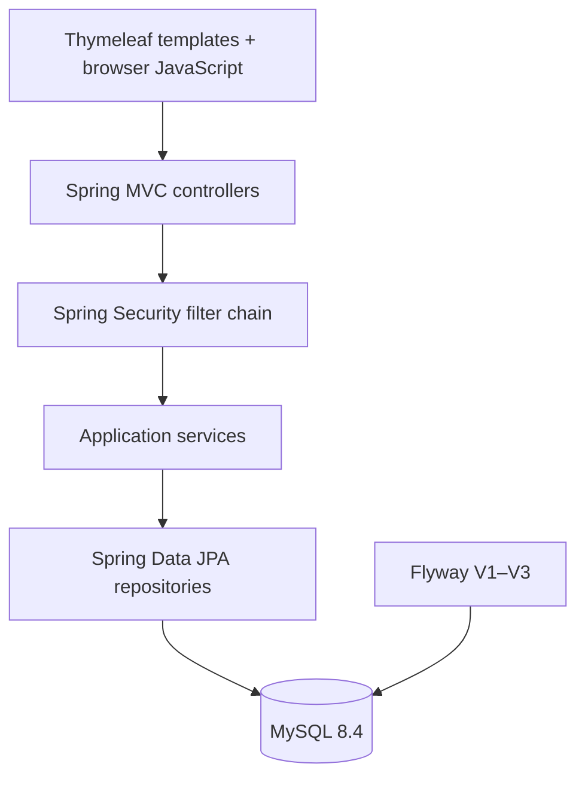

# CampusConnect technical guide

> **Audience:** Maintainers and contributors who need implementation-level context
> **Current baseline:** Java 25, Spring Boot 4.1.0, MySQL 8.4, Flyway V1–V3
> **Architecture:** Secure Spring MVC modular monolith

This guide explains how the application is assembled and where a change belongs. For first-time setup, use the [README](README.md). For operational procedures, use the [operations guide](docs/operations/README.md); for threat and control details, use the [security guide](docs/security/README.md).

## 1. System shape

CampusConnect follows a conventional layered architecture with explicit logical modules. The application is one deployable unit, but responsibilities are kept separate so that the event catalogue, identity, interest tracking, recommendation scoring, and operations concerns can evolve independently.



### Responsibility boundaries

| Layer | Responsibility | Representative files |
| --- | --- | --- |
| Presentation | Render student/admin views, expose targeted operational/API endpoints, and submit CSRF-protected forms | `src/main/resources/templates/`, `EventController`, `AdminController`, `AuthController` |
| Security | Authenticate sessions, apply RBAC, rate-limit login, validate CSRF, and add secure headers | `SecurityConfig`, `RateLimitingFilter`, `SecurityAuditLogger` |
| Application services | Enforce lifecycle, validation, transaction, media, export, and recommendation rules | `EventService`, `UserService`, `SessionService`, `RecommendationService` |
| Persistence | Execute indexed, parameterized, fetch-join, and transaction-sensitive queries | `EventRepository`, `UserRepository`, `RegistrationRepository` |
| Data | Own normalized tables, constraints, indexes, and migration history | `src/main/resources/db/migration/` |
| Operations | Provide health, metrics, structured logs, container startup, and CI evidence | Actuator, Micrometer, Logback, Docker, `.github/workflows/ci.yml` |

## 2. Technology baseline

| Component | Current choice |
| --- | --- |
| Runtime and language | Java 25 |
| Application framework | Spring Boot 4.1.0 / Spring Framework 7 |
| Web layer | Spring MVC, Thymeleaf, Springdoc OpenAPI 3.1.0 |
| Persistence | Spring Data JPA / Hibernate with MySQL 8.4 |
| Schema authority | Spring Boot 4 Flyway starter plus `flyway-mysql` 12.4.0 with V1–V3 migrations; Hibernate runs in `validate` mode in production |
| Security | Spring Security 7 session authentication, CSRF, RBAC, BCrypt, secure headers |
| Resilience | Resilience4j 2.4.0 Boot 4 adapter and Bucket4j 8.10.1 |
| Observability | Spring Boot Actuator, Micrometer Prometheus registry, structured Logback encoder |
| Build and quality | Maven 3.9.11 Wrapper, Surefire 3.5.4, JaCoCo 0.8.15 |
| Delivery | Multi-stage Eclipse Temurin 25 container, Docker Compose, GitHub Actions |

The complete version decision record is in [`docs/stable-versions.md`](docs/stable-versions.md).

## 3. Request and data flows

### Event discovery

1. A public browser requests a student route.
2. Spring Security permits the public route and applies secure response headers.
3. `EventController` delegates filtering and pagination to `EventService`.
4. `EventRepository` performs indexed date/category/search queries.
5. `RecommendationService` derives a small, explainable list from upcoming events and the current user’s prior interests when a user context is available.
6. Thymeleaf renders the catalogue and recommendation cards without trusting client-side scores or roles.

### Interest workflow

1. The user submits an interest request for an event.
2. The controller validates the session and request parameters.
3. A fast duplicate check avoids unnecessary work.
4. The service enters a transaction and reloads the event with a pessimistic row lock.
5. A second duplicate check closes the concurrent-write race.
6. A unique `(user_id, event_id)` constraint provides a database backstop.
7. Resilience4j records and handles the bounded external-registration integration path.

### Administrative mutation

1. A request reaches `/admin/**`.
2. Spring Security requires `ROLE_ADMIN`, a valid session, and CSRF for state-changing methods.
3. The controller validates the form and delegates to the service layer.
4. The service validates dates, URLs, capacity, media type, and ownership-sensitive behavior.
5. JPA persists the change inside the appropriate transaction.
6. Audit logging records the security-relevant operation without exposing secrets.

## 4. Domain model

| Entity | Purpose | Important integrity rule |
| --- | --- | --- |
| `User` | Authentication identity and role | Username is unique; passwords are stored as BCrypt hashes |
| `Event` | Catalogue item, dates, venue, category, media, and external link | Positive capacity and end-after-start checks are enforced |
| `Registration` | Student interest and lifecycle status | Unique user-event pair and foreign keys prevent duplicates/orphans |
| `RecommendedEvent` | Derived view model for a recommendation | Never persisted; MySQL event and interest data remain authoritative |

The term “registration” is deliberately qualified in the product documentation: the current record is local interest tracking, while the configured external URL remains the authoritative registration system.

## 5. Media handling

Event images are validated at the application boundary, constrained by request size, and stored as database-backed media. The service validates content type and file size, uses safe generated identifiers, and exposes only controlled resource paths. Production deployments must use durable database storage and backup procedures; local generated uploads must never be committed.

## 6. Security implementation

The security perimeter is defense in depth:

| Control | Implementation |
| --- | --- |
| Authentication | Session-based form login with BCrypt strength 12 and production-required admin secret |
| Authorization | `/admin/**` requires `ROLE_ADMIN`; public routes are explicitly allowlisted |
| Session security | Session fixation mitigation, HTTP-only cookies, strict same-site behavior, and production `Secure` cookies |
| CSRF | Cookie-backed CSRF token repository with tokens required for state changes |
| Abuse control | Bucket4j login rate limit and safe error behavior |
| Input safety | Bean Validation, URL scheme checks, media validation, bounded request sizes |
| Browser hardening | Content Security Policy, frame denial, referrer policy, content-type protection |
| Auditability | Hashed user identifiers in audit messages and security-relevant event records |

Read [`docs/security/README.md`](docs/security/README.md) for the threat model and residual risks.

## 7. Database and migration rules

Flyway owns schema creation and change history. Each migration is additive or explicitly reviewed, named using the `V<version>__<description>.sql` convention, and validated by CI against MySQL 8.4. Hibernate must not create or mutate production schema.

```bash
# Inspect migration files
find src/main/resources/db/migration -maxdepth 1 -type f -print | sort

# Validate a normal application build
./mvnw -B verify
```

A local environment with MySQL 8.0 may be incompatible with Flyway 12. Do not remove the Flyway starter or lower production validation to make that environment pass. Use MySQL 8.4 through Compose/CI, or apply the committed V1–V3 schema manually for a code-only local check with Flyway disabled.

## 8. Change guide

| Change | Start with | Required evidence |
| --- | --- | --- |
| New event behavior | `EventService`, `EventController`, relevant templates | Unit/service test, controller test, requirements update |
| New schema field | Entity, Flyway migration, repository/service | Migration review, clean-database verification, rollback note |
| Security change | `SecurityConfig` and security tests | Authorization matrix, CSRF/session test, security documentation |
| Recommendation change | `RecommendationService` and DTO tests | Deterministic scoring tests, no client authority, performance review |
| Operational change | `application*.properties`, Docker, CI, operations guide | Health/metrics evidence, secret review, runbook update |
| API change | Controller and OpenAPI configuration | Route contract, validation/error behavior, smoke or controller test |

## References

[1]: https://spring.io/projects/spring-boot "Spring Boot project"
[2]: https://docs.spring.io/spring-security/reference/ "Spring Security reference"
[3]: https://documentation.red-gate.com/flyway/reference "Flyway reference"
[4]: https://owasp.org/API-Security/editions/2023/en/0x00-header/ "OWASP API Security Top 10"
