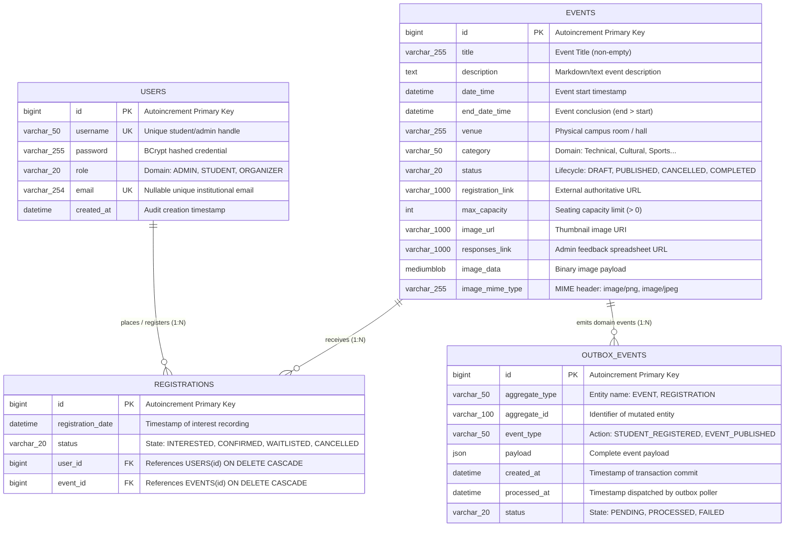

# CampusConnect — Entity-Relationship (ER) Architecture (CO2)

This document specifies the conceptual and logical data model for **CampusConnect** (Course 25CS1302E).

---

## 1. Formal Entity-Relationship Diagram (Mermaid)

---

## 2. Structural Characteristics & Invariants

### A. Cardinality and Multiplicity
- **USERS to REGISTRATIONS**: $1:N$ (One user can register for zero, one, or multiple events).
- **EVENTS to REGISTRATIONS**: $1:N$ (One event can receive zero, one, or many student registrations).
- **USERS to EVENTS**: $M:N$ (Resolved into two $1:N$ relationships via the `REGISTRATIONS` associative junction entity).
- **EVENTS to OUTBOX_EVENTS**: $1:N$ (An event modification produces one or more asynchronous outbox events).

### B. Participation Constraints
| Entity | Relationship | Participation | Rationale |
|---|---|---|---|
| **USERS** | `REGISTRATIONS` | **Partial** | A user can register on the platform without immediately signing up for an event. |
| **EVENTS** | `REGISTRATIONS` | **Partial** | Newly published events initially have zero registered students. |
| **REGISTRATIONS** | `USERS` | **Total (Mandatory)** | A registration record cannot exist without a valid associated `user_id` ($FK \to users.id$). |
| **REGISTRATIONS** | `EVENTS` | **Total (Mandatory)** | A registration record cannot exist without a valid associated `event_id` ($FK \to events.id$). |

### C. Candidate Keys & Integrity Constraints
1. **USERS**:
   - **Primary Key**: `id`
   - **Alternate Candidate Keys**: `username`, `email`
   - **Domain Constraint**: `role IN ('ADMIN', 'STUDENT', 'ORGANIZER')`
2. **EVENTS**:
   - **Primary Key**: `id`
   - **Domain Constraints**:
     - `max_capacity IS NULL OR max_capacity > 0`
     - `end_date_time IS NULL OR end_date_time > date_time`
     - `status IN ('DRAFT', 'PUBLISHED', 'CANCELLED', 'COMPLETED')`
     - `CHAR_LENGTH(TRIM(title)) > 0`
     - `CHAR_LENGTH(TRIM(venue)) > 0`
3. **REGISTRATIONS**:
   - **Primary Key**: `id`
   - **Candidate Key / Unique Invariant**: `(user_id, event_id)` via `CONSTRAINT uk_user_event UNIQUE (user_id, event_id)`
   - **Referential Integrity**: Cascading deletion ensures zero orphaned junction records when a parent user or event is purged.
   - **Domain Constraint**: `status IN ('INTERESTED', 'CONFIRMED', 'CANCELLED', 'WAITLISTED')`
4. **OUTBOX_EVENTS**:
   - **Primary Key**: `id`
   - **Domain Constraint**: `status IN ('PENDING', 'PROCESSED', 'FAILED')`
