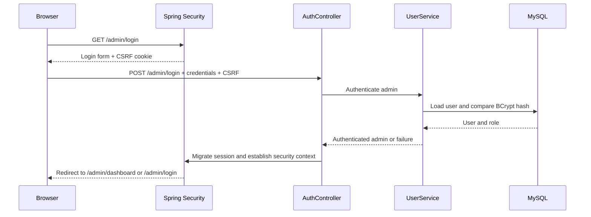

# API and contract documentation

## Contract position

CampusConnect currently serves server-rendered pages through Spring MVC and also exposes generated OpenAPI metadata through Springdoc. The API documentation endpoint is available at `/v3/api-docs` and the interactive UI at `/swagger-ui.html` when the application is running. The generated specification should be treated as the source of truth for any future frontend or service client.

The current release is not a pure REST API. Public event browsing is rendered as HTML, while image delivery, CSV export, and form workflows use targeted HTTP endpoints. This distinction is deliberate and documented so the project does not claim a REST-only architecture that the code does not implement.

## Route inventory

| Route family | Access | Behavior |
| --- | --- | --- |
| `/` and `/student/**` | Public browsing boundary | Guest session is established for the student experience, then event discovery and detail pages are served |
| `/student/api/public/events/image/{id}` | Public | Serves validated event image bytes with MIME type, ETag, and cache headers |
| `/student/register-external/{eventId}` | Public student flow | Records interest where possible and redirects only to an HTTP/HTTPS event registration link |
| `/admin/login` | Public login boundary | Presents and processes the administrative login form with CSRF protection |
| `/admin/**` | `ADMIN` role | Dashboard, event lifecycle mutations, analytics, and CSV export |
| `/actuator/health` | Public operational check | Returns application health for deployment probes |
| `/v3/api-docs/**`, `/swagger-ui/**` | Public documentation | Exposes generated API metadata and UI for review; restrict at ingress if the deployment requires private docs |
| `/actuator/prometheus` | Protected operational endpoint | Prometheus-compatible metrics; scrape through a private network or authenticated monitoring path |

## HTTP and validation conventions

State-changing form requests use POST and carry a CSRF token. Authentication failures redirect to the admin login page, while validation failures return the application’s error/redirect flow with user-readable messages. Event registration URLs accept only `http://` and `https://` schemes to prevent unsafe protocol redirects. Upload validation checks file type, size, filename/path safety, and supported image formats before persistence.

Any future JSON API should standardize the following contract before implementation: resource-oriented nouns, stable pagination fields, explicit sort order, RFC 3339 timestamps with documented time-zone behavior, a consistent validation-error envelope, correlation identifiers, and idempotency keys for operations that can be retried. The RealWorld API references in the supplied repository list are useful for comparing auth, CRUD, and pagination behavior, but CampusConnect’s event domain remains the governing contract.

## Authentication and authorization flow

## Future gateway and service contract

If the application later becomes polyglot, a FastAPI gateway may provide JSON aggregation and token forwarding, while the existing Spring Boot module remains the transactional event service. A Node.js service may own flexible activity or notification documents. Each service must publish an explicit OpenAPI or event schema, own its database writes, and define timeout, retry, idempotency, and fallback behavior before it is independently deployed.

## References

[1]: https://springdoc.org/ "Springdoc OpenAPI"
[2]: https://spec.openapis.org/oas/latest.html "OpenAPI Specification"
[3]: https://github.com/gothinkster/realworld "RealWorld API interoperability reference"
[4]: https://fastapi.tiangolo.com/ "FastAPI reference for future gateway evaluation"
