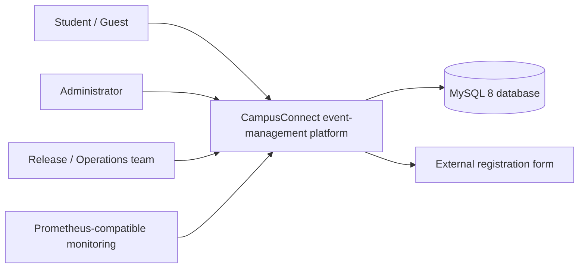
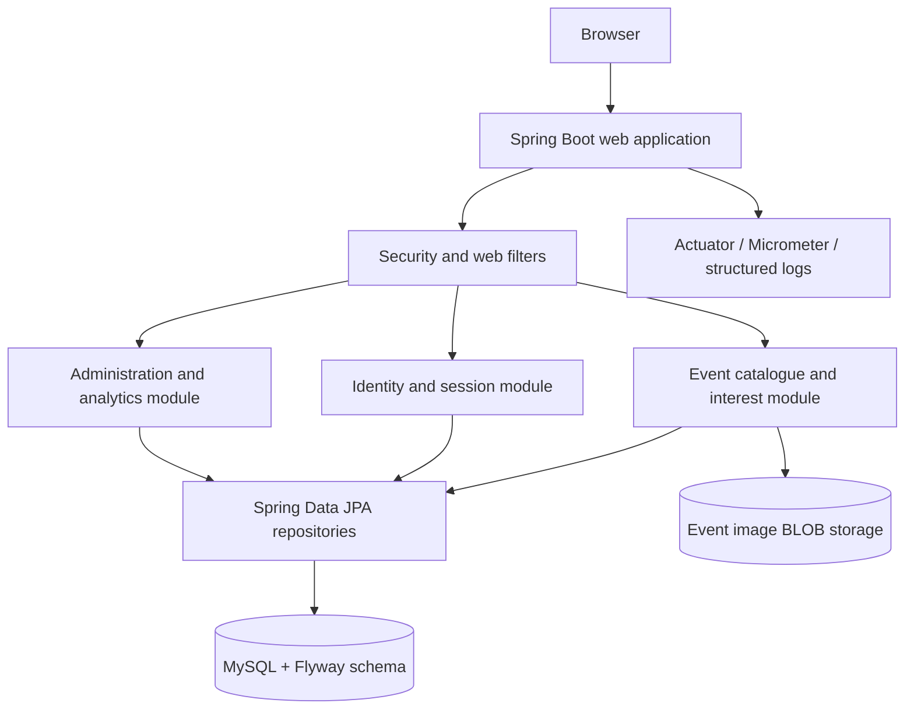
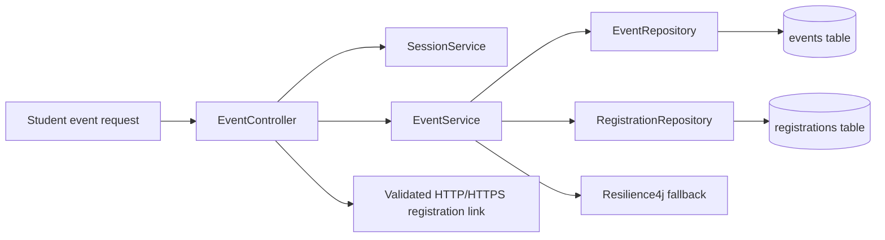
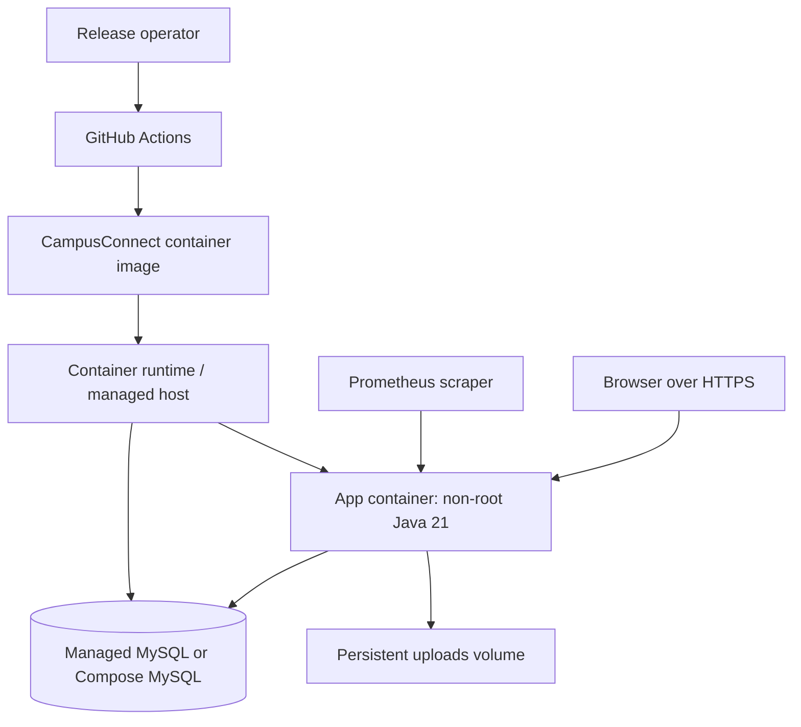

# Architecture and C4 views

## Architectural position

CampusConnect is currently a **modular monolith**. A single Spring Boot deployment serves the student and administrator web surfaces, applies security and validation, executes event/user business logic, and accesses MySQL through JPA repositories. This is the fastest production path because it preserves one deployable unit while keeping domain boundaries explicit enough for later extraction.

The design uses the following logical layers:

| Layer | Responsibility | Current evidence |
| --- | --- | --- |
| Presentation | Thymeleaf views, static assets, public student routes, and admin routes | `src/main/resources/templates`, `EventController`, `AdminController` |
| Security | Authentication, role checks, CSRF, session policy, rate limiting, security headers | `SecurityConfig`, `RateLimitingFilter`, `SecurityAuditLogger` |
| Application services | Event lifecycle, user authentication, session state, interest tracking, analytics, media handling | `EventService`, `UserService`, `SessionService` |
| Persistence | Repositories, JPA mappings, Flyway migrations, database-backed image storage | `repository/`, `model/`, `db/migration/` |
| Operations | Health, metrics, structured logs, resilience fallback, container/runtime configuration | Actuator, Micrometer, Resilience4j, Dockerfile, Compose |

## C4 context view

## C4 container view

## C4 component view of the event path

## Deployment view

## Bounded contexts and extraction path

| Bounded context | Current module | Data ownership today | Extraction candidate |
| --- | --- | --- | --- |
| Identity and access | `UserService`, `AuthController`, `SecurityConfig` | `users` | Keep in gateway or extract only for SSO/tenancy |
| Event catalogue | `EventService`, `EventController`, event model/repository | `events` and event media | First independent service if scale requires it |
| Interest/registration | `EventService`, `RegistrationRepository` | `registrations` | Extract when internal capacity/ticketing is introduced |
| Administration and analytics | `AdminController`, analytics queries | Read models over event/registration data | Extract reporting asynchronously if dashboards become expensive |
| Activity/notification/search | Not yet a separate runtime module | No separate store | Candidate for Node.js/MongoDB or FastAPI/vector adapter |

The handout’s polyglot and microservices outcomes are represented honestly as an evolution path. A future FastAPI gateway may aggregate public search and forward tokens; a Node.js service may own flexible activity/notification documents; and a Spring Boot transactional service may own internal registrations. The current release does not claim those services are deployed.

## Resilience and distributed-workflow decision

The present application has one process and one transactional database, so a local database transaction is preferred over distributed coordination. If a future registration flow spans event capacity, notification, and external registration, the preferred design is an outbox plus idempotent consumers and compensating actions. A Saga should be documented and tested before Kafka or another broker is introduced; two-phase commit is not assumed.

## References

[1]: https://c4model.com/ "C4 model"
[2]: https://docs.spring.io/spring-boot/docs/current/reference/html/actuator.html "Spring Boot Actuator"
[3]: https://docs.docker.com/compose/ "Docker Compose"
[4]: https://github.com/donnemartin/system-design-primer "System Design Primer"
