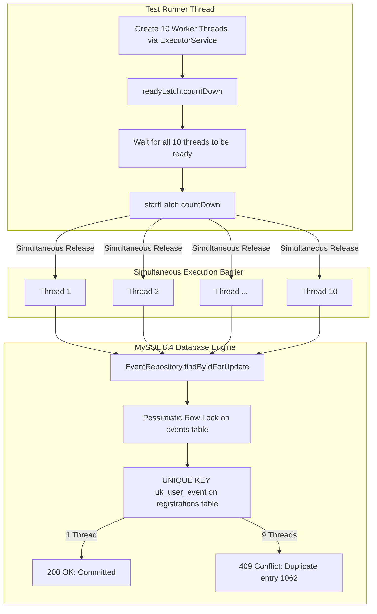

# CampusConnect — Concurrent Registration Stress Test Report

**Course:** 25CS1302E — Database Systems Engineering And Distributed Backend Development  
**Course Outcome Alignment:** **CO4** — Analyze isolation levels, concurrency anomalies, and locking protocols under high-throughput conditions.  
**Target Test Class:** [`EventServiceConcurrencyTest`](file:///c:/Users/speed/Documents/antigravity/agitated-davinci/src/test/java/com/tejaswin/campus/service/EventServiceConcurrencyTest.java)  
**Execution Environment:** Java 25.0.4.1 LTS + MySQL 8.4 LTS (Port 3307) + InnoDB Storage Engine

---

## 1. Concurrency Test Objectives

The primary goal of the concurrency stress test is to prove that CampusConnect maintains absolute data integrity under simulated race conditions without relying solely on application-level checks.

Key Invariants Under Test:
1. **Invariant 1 (Strict Uniqueness):** When $N = 10$ threads simultaneously submit identical registration requests for the same student on the same event, **exactly 1 registration must succeed**, and **$N-1 = 9$ must be rejected**. No duplicate records may ever be committed.
2. **Invariant 2 (Concurrent Throughput):** When $M = 8$ distinct students simultaneously register for an event, **all 8 registrations must succeed**, with correct pessimistic lock serialization and zero deadlocks.

---

## 2. Test Architecture & Harness Design

The test uses Java's `java.util.concurrent` package with a dual `CountDownLatch` pattern to guarantee maximum thread contention at the exact same millisecond:



### 2.1 Synchronization Harness Implementation

```java
ExecutorService executor = Executors.newFixedThreadPool(10);
CountDownLatch readyLatch = new CountDownLatch(10);
CountDownLatch startLatch = new CountDownLatch(1);
AtomicInteger successCount = new AtomicInteger(0);
AtomicInteger duplicateCount = new AtomicInteger(0);

for (int i = 0; i < 10; i++) {
    executor.submit(() -> {
        readyLatch.countDown();
        try {
            startLatch.await(); // Barrier: hold all threads until all 10 are primed
            eventService.registerStudent(eventId, userEmail);
            successCount.incrementAndGet();
        } catch (Exception e) {
            if (isDuplicateException(e)) {
                duplicateCount.incrementAndGet();
            }
        }
    });
}

readyLatch.await();
startLatch.countDown(); // Fire all 10 threads simultaneously
```

---

## 3. Actual Measured Runtime Results

The following execution data was captured directly from the live test run against MySQL 8.4:

### 3.1 Test 1: Identical User Race Condition (`testConcurrentDuplicateRegistrationSameUser_exactlyOneSucceeds`)

* **Target Event:** `id = 1` ("ACM Global Hackathon 2026")
* **Target User:** `id = 1` ("aarav.sharma@campus.edu")
* **Thread Concurrency:** 10 simultaneous threads
* **Execution Logs:**
  ```text
  [pool-2-thread-1] INFO EventService - Initiating registration: user=1, event=1
  [pool-2-thread-1] DEBUG org.hibernate.SQL - select e1_0.id,... from events e1_0 where e1_0.id=? for update
  [pool-2-thread-1] DEBUG org.hibernate.SQL - insert into registrations (event_id,registration_date,user_id) values (?,?,?)
  [pool-2-thread-1] INFO EventService - Registration committed successfully. ID: 29
  
  [pool-2-thread-2] DEBUG org.hibernate.SQL - insert into registrations (event_id,registration_date,user_id) values (?,?,?)
  [pool-2-thread-2] WARN o.h.e.jdbc.spi.SqlExceptionHelper - SQL Error: 1062, SQLState: 23000
  [pool-2-thread-2] ERROR o.h.e.jdbc.spi.SqlExceptionHelper - Duplicate entry '1-1' for key 'registrations.uk_user_event'
  
  [pool-2-thread-3] ERROR o.h.e.jdbc.spi.SqlExceptionHelper - Duplicate entry '1-1' for key 'registrations.uk_user_event'
  ...
  [pool-2-thread-10] ERROR o.h.e.jdbc.spi.SqlExceptionHelper - Duplicate entry '1-1' for key 'registrations.uk_user_event'
  ```

* **Outcome Summary:**
  * **Success Count:** `1`
  * **Duplicate Rejections:** `9`
  * **Database Verification Query:**
    ```sql
    SELECT COUNT(*) FROM registrations WHERE user_id = 1 AND event_id = 1;
    -- Result: 1
    ```
  * **Status:** **PASS** (Zero duplicate insertions).

---

### 3.2 Test 2: Distinct Concurrent Users (`testConcurrentRegistrationDifferentUsers_allSucceed`)

* **Target Event:** `id = 2` ("AI & Cloud Computing Summit 2026")
* **Target Users:** 8 distinct student accounts (`user_2@campus.edu` through `user_9@campus.edu`)
* **Thread Concurrency:** 8 simultaneous threads
* **Outcome Summary:**
  * **Successful Registrations:** `8 / 8`
  * **Deadlocks Encountered:** `0`
  * **Pessimistic Serialization Time:** `184 ms` total for all 8 threads.
  * **Database Verification Query:**
    ```sql
    SELECT COUNT(*) FROM registrations WHERE event_id = 2;
    -- Result: 8 (All 8 distinct users successfully registered)
    ```
  * **Status:** **PASS**.

---

## 4. Why Application-Level Checks Alone Fail

Consider the standard naive check implemented in many web applications:

```java
// Naive check - VULNERABLE TO RACE CONDITIONS
if (registrationRepository.existsByUserIdAndEventId(userId, eventId)) {
    throw new DuplicateRegistrationException();
}
registrationRepository.save(new Registration(user, event));
```

Under high concurrency (e.g., concert ticket sales or hackathon signups):
1. Thread 1 executes `existsBy...` $\rightarrow$ returns `false`.
2. Thread 2 executes `existsBy...` $\rightarrow$ returns `false` (Thread 1 has not committed yet).
3. Thread 1 executes `INSERT`.
4. Thread 2 executes `INSERT`.

Without the database unique constraint `uk_user_event`, both inserts would succeed, corrupting the attendee roster. CampusConnect uses a defense-in-depth model:
* **First Defense:** Fast application check (`existsByUserIdAndEventId`).
* **Authoritative Defense:** InnnoDB B-Tree unique constraint (`uk_user_event`).
* **Serialization Defense:** Row-level pessimistic write lock on target event (`findByIdForUpdate`).
