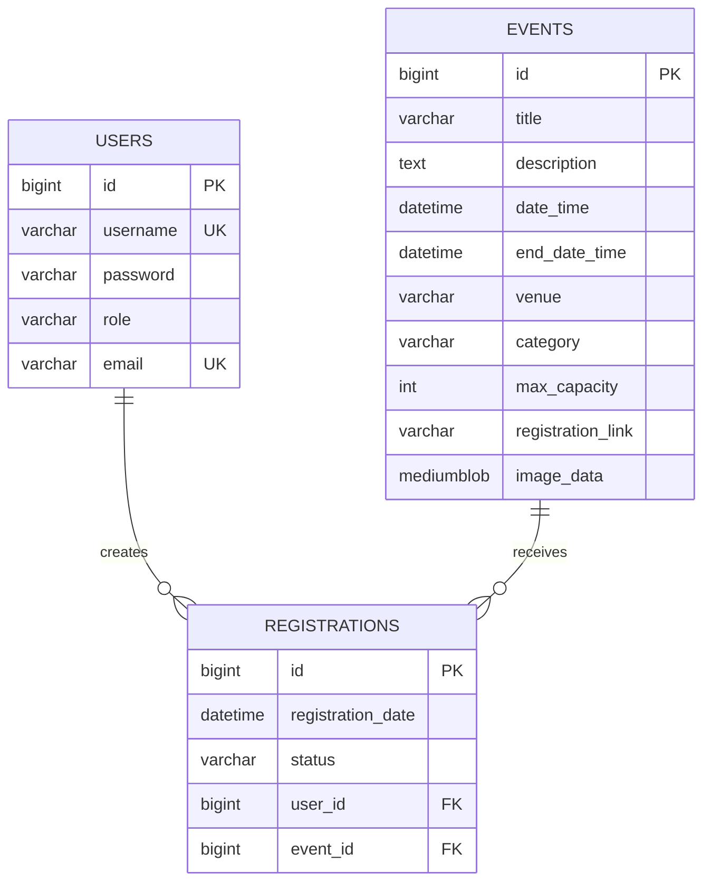

# Data engineering

## Relational source of truth

MySQL 8.4 is the authoritative store for CampusConnect’s current transactional data. JPA entity mappings describe the application model, while Spring Boot’s Flyway starter plus `org.flywaydb:flyway-mysql` 12.4.0 define the database migration runtime. Production uses `DDL_AUTO=validate`, so Hibernate cannot silently mutate the schema.

The core model is normalized around users, events, and registrations. Users and events are independent entities; registrations resolve the many-to-many relationship between them and carry relationship-specific attributes such as registration date and interest status.



## Migration inventory

| Migration | Purpose | Compliance evidence |
| --- | --- | --- |
| `V1__Initial_Schema.sql` | Creates users, events, and registrations with primary keys, unique keys, foreign keys, and capacity check | CO1 normalized relational schema and integrity |
| `V2__Add_Image_Blob_Columns.sql` | Adds database-backed event image data and MIME type | Media persistence and deployment portability |
| `V3__Add_event_query_indexes_and_integrity_checks.sql` | Adds date/category/registration indexes and event/status checks | Query-aware indexing, integrity, and analytics readiness |

## Constraints and indexes

The `users` table enforces unique usernames and emails. The `registrations` table enforces one row per user-event pair and foreign-key references to both parent entities. The `events` table enforces positive capacity and, from V3, an end time later than the start time when an end time is provided. Registration status is constrained to `INTERESTED`, `CONFIRMED`, `CANCELLED`, or `WAITLISTED` to prevent uncontrolled status vocabulary.

The event catalogue is commonly ordered by date, filtered by category, and used for time-based analytics. V3 therefore adds indexes on `date_time` and `(category, date_time)`. Registration analytics commonly group by event and status or filter by user and status, so V3 adds `(event_id, status)` and `(user_id, status)` indexes. These are tied to repository query patterns rather than added speculatively.

## Transaction and concurrency strategy

The current external-registration flow records student interest, not a seat reservation. `EventService.registerStudent` is transactional and performs a fast duplicate check, loads the user, obtains a pessimistic write lock on the event row, repeats the duplicate check, and inserts the unique relationship row. This protects the user-event interest write under concurrent requests while leaving the external registration system authoritative for actual seats.

If CampusConnect introduces internal capacity management, the design must add an explicit seat state machine, a transactionally locked capacity counter or equivalent reservation table, idempotency keys, cancellation rules, and integration tests for concurrent requests. The current `max_capacity` field alone is not a ticketing implementation.

## Representative SQL evidence

```sql
-- Upcoming events by category, aligned with the catalogue index.
SELECT category, COUNT(*) AS event_count
FROM events
WHERE date_time > UTC_TIMESTAMP()
GROUP BY category
ORDER BY event_count DESC;

-- Interest analytics by event and status, aligned with V3 index support.
SELECT event_id, status, COUNT(*) AS registrations
FROM registrations
GROUP BY event_id, status
ORDER BY event_id, status;

-- A transaction-sensitive interest write is represented by the application service,
-- the unique user-event constraint, and the pessimistic event-row lock.
```

## SQL versus NoSQL and vector-search decision

| Concern | Relational MySQL now | Document store option | Vector-search option |
| --- | --- | --- | --- |
| Event lifecycle | Strong fit because event fields, references, constraints, and analytics are structured | Not needed for the current core record | Not authoritative |
| Flexible activity/audit payloads | Possible but requires schema evolution | MongoDB could own append-oriented activity documents | Not applicable |
| Event discovery | Indexed title, venue, category, and date queries | Text indexes could support flexible metadata | pgvector or another vector store could support semantic similarity |
| Consistency | Single database transaction for current interest writes | Explicit eventual-consistency contract required | Embeddings are derived data and may lag source events |
| Operational cost | Already provisioned and tested | Adds a second database and backup path | Adds embedding generation, storage, filtering, and evaluation |

The recommended polyglot boundary is to keep authoritative event and user state in MySQL, introduce a document store only for independently useful activity/notification data, and treat embeddings as derived search data. A semantic search adapter must filter out unpublished or unauthorized events and retain lexical search as a safe fallback.

## Backup and retention assumptions

A production deployment must back up MySQL and the uploads volume, test restores, protect database credentials, and define retention for registrations, audit events, and images. The repository supplies the migration and volume contract but cannot determine provider-specific backup retention without a deployment target.

## References

[1]: https://documentation.red-gate.com/flyway/reference "Flyway reference"
[2]: https://dev.mysql.com/doc/refman/8.4/en/ "MySQL 8.4 reference manual"
[3]: https://www.postgresql.org/docs/current/ddl-constraints.html "Relational constraint concepts"
[4]: https://github.com/prisma/prisma "Schema-first ORM comparison reference"
