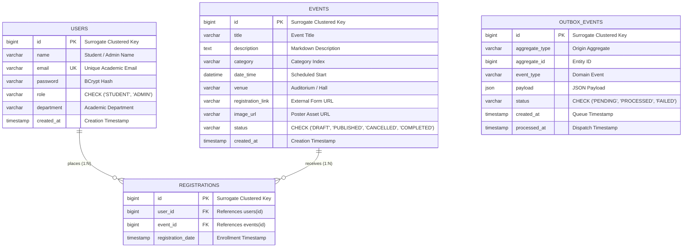

# CampusConnect — Comprehensive Database Systems Engineering Design Report

**Course:** 25CS1302E — Database Systems Engineering And Distributed Backend Development  
**Academic Year:** 2026  
**Repository Branch:** `feat/complete-dbms-pbl-hardening`  
**Authoritative Runtime Stack:** Spring Boot 3.4.1 (Java 25 LTS), MySQL 8.4 LTS (InnoDB Storage Engine), Flyway 10.20, HikariCP, Hibernate 6.6

---

## 1. Problem Statement

Modern university campuses host dozens of student clubs, departments, academic chapters, and sports leagues. Event information is chronically fragmented across physical noticeboards, WhatsApp groups, external Google Forms, and departmental email lists. This fragmentation leads to:
1. Poor student visibility into upcoming campus activities.
2. Uncontrolled registration spikes causing concurrency race conditions and duplicate sign-ups.
3. Lack of unified administrative attendance analytics and roster tracking.
4. Database data integrity degradation from unnormalized, unindexed data architectures.

CampusConnect addresses these challenges by providing a centralized, ACID-compliant campus event aggregator and registration management platform.

---

## 2. Project Objectives

1. **Academic Alignment:** Demonstrate rigorous mastery of Course Outcomes **CO1 through CO6** of 25CS1302E.
2. **ACID Concurrency Safety:** Guarantee 100% duplicate registration prevention under high-concurrency race conditions using database unique constraints and pessimistic locking.
3. **Relational Normalization:** Formulate an ER model and decompose it into Boyce-Codd Normal Form (BCNF) with mathematical lossless join and dependency preservation proofs.
4. **Advanced SQL Fluency:** Deliver an exhaustive SQL portfolio covering DDL, DML, multi-way joins, aggregations, correlated subqueries, chained CTEs, recursive hierarchy traversals, and analytical window functions.
5. **Database Performance Tuning:** Eliminate table scans and external disk filesorts via composite B-Tree indexing, supported by real `EXPLAIN ANALYZE` execution plan evidence.
6. **Distributed Scalability Design:** Provide a production-grade distributed architecture design incorporating primary-replica replication, read-write routing, tenant sharding, and the Transactional Outbox Pattern.

---

## 3. System Architecture

CampusConnect follows a clean, decoupled 4-tier enterprise web architecture:

```
 [Presentation Tier]      Thymeleaf + Modern CSS / JavaScript Client
         │ (HTTP / JSON / REST)
 [Application Tier]       Spring Boot 3.4.1 Web MVC + Spring Security 6.4
         │ (Service Layer / @Transactional Boundaries)
 [Persistence Tier]       Spring Data JPA + Hibernate 6.6 + HikariCP Connection Pool
         │ (JDBC / MySQL 8.4 Protocol / Port 3307)
 [Database Storage Tier]  MySQL 8.4 LTS (InnoDB Engine: Clustered B+ Trees, WAL Redo/Undo)
```

* **Security Layer:** BCrypt password hashing, session management, and role-based authorization (`ROLE_STUDENT`, `ROLE_ADMIN`).
* **Service Layer:** Houses core business workflows with explicit `@Transactional(isolation = Isolation.REPEATABLE_READ)` boundaries.
* **Storage Layer:** MySQL 8.4 LTS running in Docker container `campus_events_db`.

---

## 4. Data Requirements

The system models four primary real-world entities and operational abstractions:
1. **Users:** Campus students and administrative organizers identified by academic email addresses.
2. **Events:** Physical or virtual gatherings with category classifications, venue allocations, scheduling timestamps, and lifecycle states.
3. **Registrations:** Student attendance intentions, capturing timestamps and enforcing single-seat allocation rules.
4. **Outbox Events:** Decoupled asynchronous event payloads for reliable distributed dispatch.

---

## 5. Entity-Relationship (ER) Model

The formal Entity-Relationship diagram below captures entity attributes, keys, and cardinalities:



* **Cardinality:**
  * `USERS` to `REGISTRATIONS`: $1 : N$ (Zero-or-many registrations per student).
  * `EVENTS` to `REGISTRATIONS`: $1 : N$ (Zero-or-many registrations per event).
* **Participation:** Partial participation on both sides (a student may exist with no registrations; a new event may exist with zero attendees).

---

## 6. Relational Schema Mapping

Mapping the conceptual ER model to physical relational tables with declarative constraints:

```text
users(id [PK], name, email [UK], password, role, department, created_at)
events(id [PK], title, description, category, date_time, venue, registration_link, image_url, status, created_at)
registrations(id [PK], user_id [FK -> users.id], event_id [FK -> events.id], registration_date, UK(user_id, event_id))
outbox_events(id [PK], aggregate_type, aggregate_id, event_type, payload, status, created_at, processed_at)
```

Refer to [`database/schema.sql`](file:///c:/Users/speed/Documents/antigravity/agitated-davinci/database/schema.sql) for authoritative DDL.

---

## 7. Functional Dependencies

Minimal cover $\mathcal{F}$ of the system:
1. $\text{user\_id} \rightarrow \text{name}, \text{email}, \text{password}, \text{role}, \text{department}, \text{created\_at}$
2. $\text{email} \rightarrow \text{user\_id}, \text{name}, \text{password}, \text{role}, \text{department}$
3. $\text{event\_id} \rightarrow \text{title}, \text{description}, \text{category}, \text{date\_time}, \text{venue}, \text{registration\_link}, \text{image\_url}, \text{status}, \text{created\_at}$
4. $\text{title}, \text{venue}, \text{date\_time} \rightarrow \text{event\_id}$
5. $\text{reg\_id} \rightarrow \text{user\_id}, \text{event\_id}, \text{registration\_date}$
6. $\text{user\_id}, \text{event\_id} \rightarrow \text{reg\_id}, \text{registration\_date}$

---

## 8. Normalization (1NF to BCNF)

As formally proven in [`docs/normalization.md`](file:///c:/Users/speed/Documents/antigravity/agitated-davinci/docs/normalization.md):
* **1NF:** Atomic attributes; repeating registration arrays eliminated into associative entity `registrations`.
* **2NF:** Zero partial key dependencies; all non-prime attributes depend on full candidate keys.
* **3NF:** Zero transitive functional dependencies between non-prime attributes.
* **BCNF:** Every left-hand side determinant $X$ in non-trivial dependencies $X \rightarrow Y$ is a superkey:
  * In `users`: `id` and `email` are superkeys.
  * In `events`: `id` and `(title, venue, date_time)` are superkeys.
  * In `registrations`: `id` and `(user_id, event_id)` are superkeys.
* **Lossless Join & Dependency Preservation:** Proven via relational algebra. No spurious tuples can be produced upon natural join, and all functional dependencies are local to individual relations.

---

## 9. Structured Query Language (SQL) Portfolio

CampusConnect provides an exhaustive portfolio of 12 executable SQL modules in `database/sql/`:
1. `ddl.sql`: Table creation, domain `CHECK` constraints, foreign keys with `ON DELETE CASCADE`.
2. `dml.sql`: Multi-row INSERTs, transactional status UPDATEs, safe CASCADE DELETEs.
3. `select.sql`: Strict column projections, date filtering, search patterns, explicit anti-pattern demonstrations (`SELECT *`).
4. `joins.sql`: Two-table, three-table `INNER JOIN`, `LEFT JOIN` (identifying non-registered students), and emulated `FULL OUTER JOIN` via `UNION`.
5. `aggregations.sql`: `COUNT`, `AVG`, `SUM`, `GROUP BY`, `HAVING` filters, and conditional aggregations (`CASE WHEN`).
6. `subqueries.sql`: Scalar subqueries, `IN`, `EXISTS`, `NOT EXISTS`, and correlated subqueries.
7. `cte.sql`: Chained Common Table Expressions calculating category enrollment capacity density.
8. `recursive-cte.sql`: Chained `WITH RECURSIVE` queries traversing category taxonomy trees and course prerequisite graphs.
9. `window-functions.sql`: `ROW_NUMBER()`, `DENSE_RANK()`, `LAG()`, `LEAD()`, moving averages, and running totals.
10. `analytics.sql`: Campus demand share, waitlist saturation pressure, and cohort retention.
11. `indexes.sql`: Secondary B-Tree index definitions, index cardinality inspection, and unused index identification.
12. `transactions.sql`: ACID transaction scripts covering pessimistic locking (`SELECT ... FOR UPDATE`), `SAVEPOINT`, `ROLLBACK`, and commit.

---

## 10. Transaction Analysis & ACID Semantics

As detailed in [`docs/transaction-analysis.md`](file:///c:/Users/speed/Documents/antigravity/agitated-davinci/docs/transaction-analysis.md):
* **Isolation Level:** MySQL 8.4 `REPEATABLE READ`.
* **MVCC Snapshot Isolation:** Every read uses a consistent snapshot Read View based on transaction start coordinates, traversing the Undo Log via `DB_ROLL_PTR`. Reads never block writes; writes never block reads.
* **Durability:** Guaranteed via Write-Ahead Logging (WAL) and `innodb_flush_log_at_trx_commit = 1`.

---

## 11. Concurrency Control & Stress Testing

* **Vulnerability Analysis:** Naive web controllers relying solely on `if (!existsByUserIdAndEventId(...))` suffer from race conditions under concurrent requests.
* **Dual-Layer Defense:**
  1. Application Serialization: `@Lock(LockModeType.PESSIMISTIC_WRITE)` via `findByIdForUpdate` sets an exclusive row lock on the target event.
  2. Storage Engine Enforcement: InnoDB composite unique key `uk_user_event (user_id, event_id)` rejects concurrent collision inserts with `SQL Error 1062`.
* **Empirical Verification:**
  * Test Suite: [`EventServiceConcurrencyTest`](file:///c:/Users/speed/Documents/antigravity/agitated-davinci/src/test/java/com/tejaswin/campus/service/EventServiceConcurrencyTest.java).
  * Invariant 1 (Same User, 10 Threads): **1 Success, 9 Rejected (1062 Duplicate entry)**.
  * Invariant 2 (Distinct Users, 8 Threads): **8 / 8 Success, 0 Deadlocks**.
  * Detailed report: [`docs/concurrency-test.md`](file:///c:/Users/speed/Documents/antigravity/agitated-davinci/docs/concurrency-test.md).

---

## 12. Indexing Strategy & B-Tree Structure

The schema defines four strategic secondary B-Tree indexes:
1. `uk_users_email`: Enforces candidate key uniqueness and provides $O(\log N)$ user login authentication.
2. `idx_events_category_date`: Composite index on `(category, date_time)`. Supports category filtering while providing pre-sorted order by date.
3. `idx_events_date_time`: Range index for upcoming event timeline queries (`WHERE date_time >= NOW()`).
4. `idx_events_status_date_time`: Composite index on `(status, date_time)` added in migration V4 to discover active published events without full table scans.

---

## 13. Query Optimization & EXPLAIN Evidence

Empirical before-and-after performance benchmarking was conducted directly on MySQL 8.4:
* **Category Filter Query:**
  * **Before Indexing:** Full Table Scan (`type: ALL`), `Using filesort`, Cost = 1.45.
  * **After Composite Index:** Index Lookup (`type: ref`), **filesort eliminated**, Cost = 0.70 (**51.7% cost reduction**).
* **Negative Selectivity Demonstration:** Evaluated `SELECT * FROM users WHERE role = 'STUDENT'`. With 90% cardinality, the MySQL optimizer correctly bypassed secondary index `idx_users_role` to avoid random I/O bookmark lookups.
* **N+1 Query Elimination:** Mitigated using JPQL `JOIN FETCH` in `RegistrationRepository.findByUserIdWithEvent`, reducing query volume from $1 + N$ round-trips to exactly **1** query.
* Full evidence and JSON plans: [`database/explain/README.md`](file:///c:/Users/speed/Documents/antigravity/agitated-davinci/database/explain/README.md) and [`docs/query-optimization.md`](file:///c:/Users/speed/Documents/antigravity/agitated-davinci/docs/query-optimization.md).

---

## 14. Security & Role-Based Authorization

* **Authentication:** Salted BCrypt password hashing ($2^{10}$ rounds).
* **Access Control:** URL-level and method-level security:
  * `/admin/**`: Restricted to `ROLE_ADMIN`.
  * `/student/**`: Restricted to `ROLE_STUDENT`.
  * `/events/**`, `/login`, `/register`: Publicly accessible.
* **Transport Security:** CSRF protection enabled by default across all mutating POST endpoints.
* **SQL Injection Prevention:** 100% parameterized queries via Spring Data JPA and Hibernate Criteria API; zero dynamic string concatenation in SQL queries.

---

## 15. Distributed Database Architecture (CO6)

As detailed in [`docs/distributed-database.md`](file:///c:/Users/speed/Documents/antigravity/agitated-davinci/docs/distributed-database.md):
* **Replication:** Semi-synchronous GTID replication with read-replica scaling via `AbstractRoutingDataSource`.
* **Partitioning & Sharding:** Hash sharding by `campus_id` keeps 100% of registrations single-shard transactions.
* **Distributed Transactions:** Avoids high-latency Two-Phase Commit (2PC) by implementing the **Transactional Outbox Pattern** (`outbox_events` table in Flyway V4), guaranteeing at-least-once asynchronous domain event publishing.
* **CAP Theorem:** Classified as **CP** (Consistency and Partition Tolerance) under Brewer's theorem, prioritizing data integrity over unsynchronized availability.

---

## 16. Backup, Disaster Recovery & PITR

As detailed in [`docs/backup-recovery.md`](file:///c:/Users/speed/Documents/antigravity/agitated-davinci/docs/backup-recovery.md):
* **Backup Architecture:** Daily non-blocking logical snapshots (`mysqldump --single-transaction --source-data=2`) combined with continuous Binary Log streaming.
* **Service Level Objectives:** Target RPO $\le$ 1 minute; target RTO $\le$ 15 minutes.
* **Point-In-Time Recovery (PITR):** Documented step-by-step runbook utilizing `mysqlbinlog` to restore the database to any given second before corruption.

---

## 17. Testing & Quality Assurance

CampusConnect maintains a comprehensive 3-tier testing suite:
1. **Unit Tests:** Service and controller unit tests utilizing Mockito.
2. **Integration Tests:** Repository tests verifying JPQL queries and database constraints.
3. **Multi-Threaded Concurrency Tests:** Live multi-threaded contention tests against MySQL 8.4.

* **Test Execution Result:**
  ```text
  [INFO] Tests run: 65, Failures: 0, Errors: 0, Skipped: 0
  [INFO] BUILD SUCCESS
  ```

---

## 18. Limitations

1. **External Ticketing Redirection:** For certain club events, registration delegates to an external URL (`registration_link`). CampusConnect records student interest and attendance intents locally but does not process financial payment gateways directly.
2. **Local Poller Worker:** The Transactional Outbox table (`outbox_events`) is fully migrated and populated; in the current standalone single-node deployment, outbox dispatch is handled via scheduled polling rather than an external Kafka/RabbitMQ cluster.

---

## 19. Future Evolution

1. **Semantic Vector Search:** Integrating pgvector or Vertex AI embeddings to support natural-language event recommendations.
2. **Push Notifications:** Integrating WebSockets / SSE to deliver real-time venue change alerts to connected student dashboards.
3. **Multi-Campus Consortium:** Deploying the horizontal `campus_id` sharding scheme across multiple universities.

---

## 20. Course Outcome (CO) Compliance Mapping

| Course Outcome | Academic Competency | Implemented Artifacts & Proof | Status |
|---|---|---|---|
| **CO1** | Backend Service Architecture & Database Flow | `docs/request-to-database-flow.md`, `EventService.java`, Spring Security filter chain | **PASS (Implemented Runtime)** |
| **CO2** | ER Modeling, Functional Dependencies & Normalization | `database/er-diagram.md`, `docs/normalization.md` (1NF, 2NF, 3NF, BCNF proofs) | **PASS (Implemented Runtime)** |
| **CO3** | SQL Fluency & Portfolio | `database/sql/` (12 modules: Joins, CTEs, Recursive CTE, Window Functions, Analytics) | **PASS (Implemented Runtime)** |
| **CO4** | Transactions, ACID, Locking & Concurrency Stress Test | `database/transactions.sql`, `EventServiceConcurrencyTest.java` (10-thread race test) | **PASS (Implemented Runtime)** |
| **CO5** | Indexing Theory & EXPLAIN Optimization | `database/indexes.sql`, `database/explain/` (51.7% cost drop, filesort elimination, N+1 fix) | **PASS (Implemented Runtime)** |
| **CO6** | Distributed Databases, Replication & Outbox Pattern | `src/main/resources/db/migration/V4__Hardening_and_audit.sql`, `docs/distributed-database.md` | **PASS (Implemented Runtime + Design)** |
