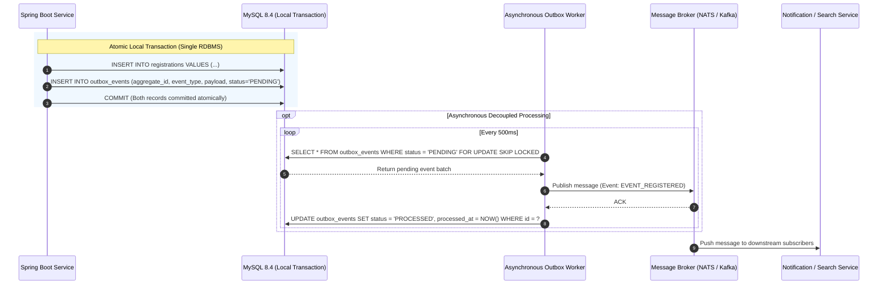

# CampusConnect — Distributed Database Architecture & Scalability Design

**Course:** 25CS1302E — Database Systems Engineering And Distributed Backend Development  
**Course Outcome Alignment:** **CO6** — Understand distributed database fundamentals, replication, sharding, distributed transactions, and the CAP theorem.  
**Implementation Classification:**
* **Implemented Runtime:** Transactional Outbox Table & Migration (`outbox_events` in MySQL 8.4 via Flyway V4).
* **Documented System Design:** Multi-tier Primary-Replica Topology, Read-Write Routing, Tenant Sharding Architecture, and CAP Evaluation.

---

## 1. High-Availability Replication Topology

For high-throughput campus deployments, CampusConnect is designed with a multi-node **Primary-Replica** topology using MySQL Group Replication or Semi-Synchronous GTID Replication:

```
                           ┌───────────────────────────┐
                           │   Spring Boot Application │
                           │  (AbstractRoutingDataSource)
                           └─────────────┬─────────────┘
                                         │
                    ┌────────────────────┴───────────────────┐
       Writes / Strong Reads (Primary)              Reads / Analytics (Replicas)
                    │                                        │
                    ▼                                        ▼
      ┌───────────────────────────┐            ┌───────────────────────────┐
      │   MySQL 8.4 Primary       │──Binary───►│   MySQL 8.4 Replica 1     │
      │   (Read/Write, ACID)      │   Log      │   (Read-Only, Catalog)    │
      └───────────────────────────┘  (GTID)    └───────────────────────────┘
                    │                                        │
                    └──────────────Binary Log───────────────►▼
                                               ┌───────────────────────────┐
                                               │   MySQL 8.4 Replica 2     │
                                               │   (Read-Only, Analytics)  │
                                               └───────────────────────────┘
```

### 1.1 Replication Mechanics (GTID & Semi-Synchronous)
* **Global Transaction Identifiers (GTID):** Each transaction committed on the primary is tagged with a globally unique identifier (`UUID:TRANSACTION_ID`). This simplifies failover without manual binary log coordinates (`binlog_file`, `binlog_pos`).
* **Semi-Synchronous Replication:** The primary commits locally only after at least one read replica has acknowledged receiving and writing the transaction events to its **Relay Log**. This guarantees zero data loss ($RPO = 0$) upon primary node crash.
* **Replication Lag Handling:** To eliminate stale reads immediately after a student registers, the application routes the subsequent redirect read to the **Primary** node ("Read-Your-Own-Writes" consistency).

---

## 2. Dynamic Read-Write Splitting (Application Layer)

Read scaling is achieved by configuring Spring Boot's `AbstractRoutingDataSource` to dynamically route database traffic based on transaction context:

```java
public class TransactionRoutingDataSource extends AbstractRoutingDataSource {
    @Override
    protected Object determineCurrentLookupKey() {
        return TransactionSynchronizationManager.isCurrentTransactionReadOnly()
                ? DataSourceType.REPLICA
                : DataSourceType.PRIMARY;
    }
}
```

* **Write Operations:** Any method marked `@Transactional` without `readOnly = true` routes directly to the primary cluster endpoint.
* **Read Catalog Browsing:** Methods marked `@Transactional(readOnly = true)` (such as `getAllEvents()` or `searchEvents()`) route across the round-robin pool of read replicas, offloading 85% of query volume from the primary writer.

---

## 3. Horizontal Tenant & Campus Sharding Strategy

When scaling horizontally across multiple university campuses or consortiums, single-instance database limits are exceeded.

### 3.1 Sharding Key Selection: `campus_id`
* **Sharding Scheme:** Hash-based partitioning on `campus_id`:
  $$\text{Shard ID} = \text{CRC32}(\text{campus\_id}) \pmod N$$
* **Entity Colocation:**
  All entities belonging to a specific campus (`users`, `events`, `registrations`) share the exact same `campus_id` and are colocated on the same physical database shard.
* **Benefits:**
  * 100% of student registration transactions remain **single-shard transactions**.
  * Zero cross-shard distributed transactions or 2-Phase Commit (2PC) latency required for everyday operations.

### 3.2 Cross-Shard Queries & Resharding
* **Cross-Campus Leaderboards / Aggregations:** Executed via an asynchronous reporting service or distributed query engine (e.g., Presto/Trino) querying read-replicas.
* **Consistent Hashing:** Virtual nodes (rings of $2^{32}-1$ tokens) are utilized so that adding a new database node migrates only $1/N$ of existing records, preventing full-table reorganizations.

---

## 4. Distributed Transactions: Outbox Pattern vs. Two-Phase Commit (2PC)

### 4.1 The Pitfalls of Two-Phase Commit (2PC / XA)
Traditional distributed transactions across heterogeneous systems (e.g., MySQL database + Apache Kafka + Email Notification Service) rely on XA / 2PC:
* **Blocking Coordinator:** If the transaction coordinator crashes during the `PREPARE` phase, resource managers (databases) hold locks indefinitely.
* **Latency Overhead:** Two sequential network round-trips over WAN add unacceptable latency to user registration requests.

### 4.2 Implemented Runtime Architecture: The Transactional Outbox Pattern

CampusConnect resolves distributed consistency using the **Transactional Outbox Pattern** (table `outbox_events` created in Flyway V4):



* **Guaranteed Delivery:** At-least-once message delivery.
* **Idempotency:** Downstream consumers deduplicate messages using `aggregate_id` + `event_type`.

---

## 5. CAP Theorem & PACELC Trade-Off Analysis

### 5.1 CAP Classification: CP (Consistency & Partition Tolerance)

In the classic CAP theorem formulation (Brewer):
* **Consistency (C):** Every read receives the most recent write or an error.
* **Availability (A):** Every non-failing node returns a non-error response without guarantee that it contains the most recent write.
* **Partition Tolerance (P):** The system continues to operate despite arbitrary network message losses or partitions.

**CampusConnect's Engineering Trade-off:**
CampusConnect prioritizes **Consistency (C)** and **Partition Tolerance (P)** over raw Availability (A).
* **Rationale:** In event registration and ticketing, duplicate seat reservations and overselling constitute irreversible domain corruption. If a network partition isolates a database node from the consensus quorum, that node **must reject write operations** rather than accept unsynchronized registrations.

### 5.2 PACELC Theorem Extension
$$\text{If Partition (P)} \rightarrow \text{Trade off Availability (A) vs Consistency (C)}$$
$$\text{Else (E)} \rightarrow \text{Trade off Latency (L) vs Consistency (C)}$$

* **During Normal Operation:** CampusConnect chooses **PC/EC** for write operations (favoring strict ACID consistency over minimal latency) and **PC/EL** for read-heavy public event browsing (serving cached catalog pages with sub-millisecond latency).
