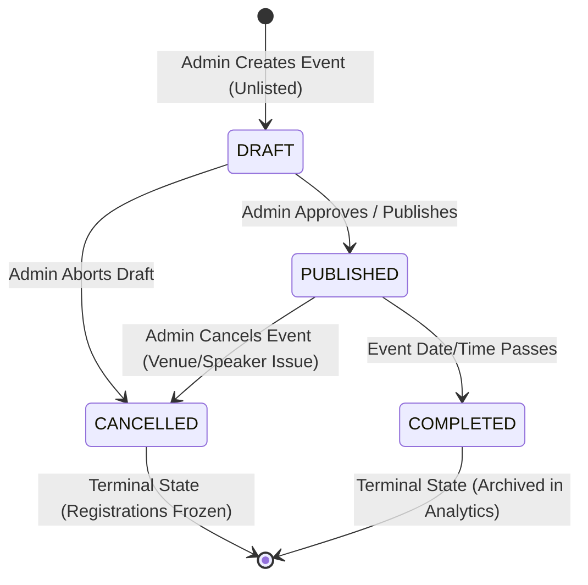

# CampusConnect — Event Lifecycle State Machine & Transition Rules

**Course:** 25CS1302E — Database Systems Engineering And Distributed Backend Development  
**Entity Target:** `com.tejaswin.campus.model.Event` / MySQL Table `events`  
**Schema Migration:** `V4__Hardening_and_audit.sql`

---

## 1. Lifecycle State Machine Diagram

Every campus event in CampusConnect follows a deterministic finite state machine enforced by database CHECK constraints and service-level validation:



---

## 2. Formal State Definitions

| State Name | Operational Definition | Visibility in Catalog | Student Registrations Permitted? |
|---|---|---|---|
| **`DRAFT`** | Initial creation state. Event details (venue, timing, description) are being configured by organizers. | Hidden from student search; visible only in Admin Dashboard. | **NO** (Rejected with `IllegalStateException`) |
| **`PUBLISHED`** | Active, public campus event. Visible on student dashboard, open for registrations or external ticket link redirection. | Fully visible across public catalog and category filters. | **YES** (Subject to duplicate checks and capacity) |
| **`CANCELLED`** | Event revoked due to unforeseen conflicts, inclement weather, or venue unavailability. | Displayed with prominent `CANCELLED` badge or filtered out. | **NO** (Rejected with `IllegalStateException`) |
| **`COMPLETED`** | Event schedule has passed (`date_time < NOW()`). | Archived; available in student historical attendance roster. | **NO** (Registration closed) |

---

## 3. Database Integrity & Domain Enforcement

In `V4__Hardening_and_audit.sql`, the lifecycle domain is locked at the database storage engine layer:

```sql
ALTER TABLE events 
ADD COLUMN status VARCHAR(20) NOT NULL DEFAULT 'PUBLISHED',
ADD CONSTRAINT chk_events_status CHECK (status IN ('DRAFT', 'PUBLISHED', 'CANCELLED', 'COMPLETED'));
```

Any attempt by external scripts, buggy ORM mappings, or unauthorized SQL updates to set an invalid state (e.g., `'ACTIVE'`, `'DELETED'`, `'PENDING'`) is immediately rejected by MySQL:
```text
ERROR 3819 (HY000): Check constraint 'chk_events_status' is violated.
```

---

## 4. Concurrency & State Locking in `EventService`

When a student attempts to register for an event, the state of the event cannot change underneath the transaction:

```java
@Transactional
public Registration registerStudent(Long eventId, String userEmail) {
    // 1. Acquire exclusive pessimistic lock on the event row
    Event event = eventRepository.findByIdForUpdate(eventId)
            .orElseThrow(() -> new ResourceNotFoundException("Event not found with ID: " + eventId));

    // 2. Validate current lifecycle invariant
    if (!"PUBLISHED".equalsIgnoreCase(event.getStatus())) {
        throw new IllegalStateException("Cannot register for event with status: " + event.getStatus());
    }

    // 3. Complete registration and persist
    ...
}
```

### Scenario: Concurrent Event Cancellation vs. Student Registration
1. **Thread A (Admin):** Cancels Event 1 (`UPDATE events SET status = 'CANCELLED' WHERE id = 1`).
2. **Thread B (Student):** Submits registration for Event 1 (`registerStudent(1, 'student@campus.edu')`).
3. **Pessimistic Serialization:**
   * If Thread A acquires the lock first, Event 1's status becomes `CANCELLED`. When Thread B subsequently acquires the lock via `findByIdForUpdate`, it reads `status = 'CANCELLED'`, throws `IllegalStateException`, and aborts registration before inserting any row.
   * If Thread B acquires the lock first, the registration commits. Thread A then acquires the lock and marks the event `CANCELLED`. The student registration is recorded, and an outbox event is triggered to notify registered attendees of the cancellation.
