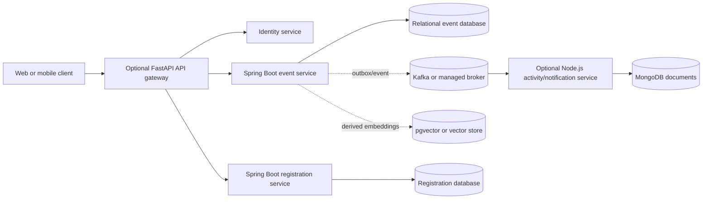

# Service boundaries and evolution

## Current modules

CampusConnect is deployed as one Spring Boot application, but its code is already organized into separable responsibilities. The current modules are logical boundaries, not independently deployed services.

| Module | Owns | Public entry points | Persistence |
| --- | --- | --- | --- |
| Identity and session | Admin authentication, BCrypt verification, session state, guest/student identity | `AuthController`, `UserService`, `SessionService` | `users` |
| Event catalogue | Event create/read/update/delete, filtering, images, external registration links | `EventController`, `AdminController`, `EventService` | `events` and image columns |
| Interest tracking | Idempotent student interest record and analytics counts | `EventController`, `EventService` | `registrations` |
| Administration | Dashboard metrics, event moderation, CSV export | `AdminController` | Read/write access to current relational model |
| Security and resilience | CSRF, RBAC, headers, login throttling, circuit-breaker fallback, audit logging | filters/configuration and cross-cutting services | Operational logs |

## Extraction principles

A service should be extracted only when it has a clear bounded context, independently valuable scaling or deployment needs, explicit data ownership, and an operational owner. Extraction must not create shared-database writes, hidden coupling through entity classes, or a distributed transaction that the team cannot operate.

The supplied [FastAPI full-stack template](https://github.com/fastapi/full-stack-fastapi-template) is a useful reference for a future API gateway or search adapter. The supplied [Spring Boot RealWorld example](https://github.com/gothinkster/spring-boot-realworld-example-app) is a useful reference for DTO/contract layering. The supplied [RealWorld specification](https://github.com/gothinkster/realworld) is a useful interoperability benchmark. None of these references is treated as a reason to rewrite a stable event-management monolith.

## Proposed future topology

## Contract rules for future services

Each service must publish an API or event schema, own its writes, define timeouts and retries, and expose health/readiness signals. Events must have stable names, schema versions, unique identifiers, producer timestamps, and idempotent consumer behavior. Cross-service workflows should prefer an outbox and compensating action over distributed two-phase commit.

The first likely extraction candidate is activity/notification/search because it can tolerate derived or eventually consistent data. The event catalogue and internal registration domains should remain together until the system has a genuine scale or ownership boundary. Identity should not be split merely to satisfy a framework checklist; it should be extracted for SSO, multi-tenancy, or independent security operations.

## Current decision

The current release remains a modular monolith. This is an explicit architecture decision, not a missing implementation. It reduces deployment complexity while providing the C4, bounded-context, resilience, and polyglot-evolution evidence required by the handout.
